# 1.常见的数据分析师的面试问题

## 1.1 基础知识考查

### **1.1.1概率论与数理统计:**

#### (1)用简洁的话语简述**随机变量**的含义。

随机变量就是一个随机的数，它是对任何的“随机的东西”做的量化。

<!--随机的对象可以是任何东西--明天的天气可以是晴、阴、雨，扔硬币的结果可以是正面或者反面，这里本身都没有数字。但是我们要借助概率论来研究它们，而概率论是数学的一部分，要用到数学语言，那么总是写“明天是晴天的概率”就很不方便，于是我们可以把晴、阴、雨贴上标签，叫做0、1、2，然后把明天的天气状况用一个字母X来表示，于是“明天下雨”就变成了“X=2”。这样，这个原本没有数字的随机结果就变成了一个可能的取值为0、1、2的随机数，这就是随机变量。-->

#### (2) 随机变量和随机试验间有什么关系

- **随机试验：**相同条件下对某随机现象进行的大量重复观测的试验，如掷硬币100次统计正面朝上的次数
- **随机变量：**是用来描述随机试验结果的。

####  (3) 划分连续型随机变量和离散型随机变量的依据。

- **离散型随机变量：**随机变量X能被一一列举出来，如一批产品中次品的数量，某地区人口的出生数等。
- **连续型随机变量：**随机变量X不能被一一列举出来，如一批电子元器件的寿命，身高、体重等。

在于所描述的随机试验所有可能的结果数量是否可数

<!--可数的含义是，所有可能的结果是否能够按照一定的次序列举出来。比如某网站每天的用户数量，可以按照1，2，3，…的次序列举出来，即使最终可能的结果数量是无限的，它也依然是离散型随机变量。而连续型随机变量的结果由于处于某个区间中，比如转化率可以是[0，1]区间中的任意值，无法按照次序列举出来，这也是二者的本质区别。-->

#### (4)变量独立和不相关的区别

若X和Y**不相关**，通常认为X和Y之间是没有线性关系，但不排除没有其他关系

若X和Y**独立**，是没有关系，互不干扰

因此，“不相关”是一个比“独立”要弱的概念

#### (5) 常见分布的分布函数/概率密度函数，以及分布的特性，如指数分布的无记忆性。:smile:

分别从离散型和连续型两方面说：

**离散型随机变量的分布**

- **二项分布**
  进行一系列独立试验 -> 每一次试验都存在成功和失败的可能，且成功的概率相同 -> 试验次数有限。

二项分布记做X~B(n,p)，X表示n次试验中的成功次数,我们要求的是成功的次数

- **伯努利分布**
  0-1分布，每次试验的结果只有2种，是n=1的二项分布的特殊情况

如掷硬币，只有正面朝上或反面朝上两种情况

- **几何分布**
  独立试验->拿到一种卡片的概率相同->为了集齐卡片要进行多少次试验
- **泊松分布**
  单独事件在给定区间内随机、独立地发生（给定区间可以是时间或空间） ->  已知该区间内的事件平均发生次数，且为有限数值。

如某加油站，平均每小时来加油的车辆为10辆，泊松分布求的这个加油站每小时前来加油的车辆次数的概率

**连续型随机变量的分布**

- **正态分布**
  又叫高斯分布，正态分布通过参数平均值和方差确定

  

- **均匀分布**
  也叫矩形分布，概率密度函数的结果是一个固定的数值

  

均匀分布在自然情况下极为罕见，它的概率密度函数为：

- **指数分布**
  指数分布是描述泊松过程中的事件之间的时间的概率分布，即事件以恒定平均速率连续且独立地发生的过程。如旅客进机场的时间间隔，还有许多电子产品的寿命分布一般服从指数分布。

其概率密度函数为：

指数分布具有无记忆的关键性质。这表示如果一个随机变量呈指数分布，当s,t>0时有P(T>t+s|T>t)=P(T>s)。即，如果T是某一元件的寿命，已知元件使用了t小时，它总共使用至少s+t小时的条件概率，与从开始使用时算起它使用至少s小时的概率相等。

#### (6) 协方差和相关系数的区别

- **协方差**

只表示相关的**方向**

衡量两个变量的总体误差，方差是协方差的特殊情况，即当两个变量是相同的情况。

如果两个变量的变化趋势一致，也就是说如果其中一个大于自身的期望值，另外一个也大于自身的期望值，那么两个变量之间的协方差就是正值（你变大，我也变大，协方差就是正的）。如果两个变量的变化趋势相反，即其中一个大于自身的期望值，另外一个却小于自身的期望值，那么两个变量之间的协方差就是负值。

也就是说，协方差为正，表示两个变量同变化，为负，不同变化

并且协方差的绝对值不反映线性相关的程度（其绝对值与变量的取值范围有关系）

但是嘞协方差为0的两个随机变量是不相关的

- **相关系数**

不仅表示线性相关的**方向**，还能衡量其**相关程度**

研究变量之间线性相关程度的量，取值范围是[-1,1]。

相关系数也可以看成协方差：一种剔除了两个变量量纲影响、标准化后的特殊协方差。

#### (7) 随机变量常用特征的解释（期望，方差等）。

（1）期望：期望是数学期望的简称，用来表示随机变量X的平均水平，记为E（X）。将X所对应的随机试验重复多次，随着试验次数的增加，X的均值X会愈发趋近于E（X）。

#### (8) 中位数是否等于期望。

标准正态分布中位数等于期望
右偏（正偏）态时，中位数小于期望

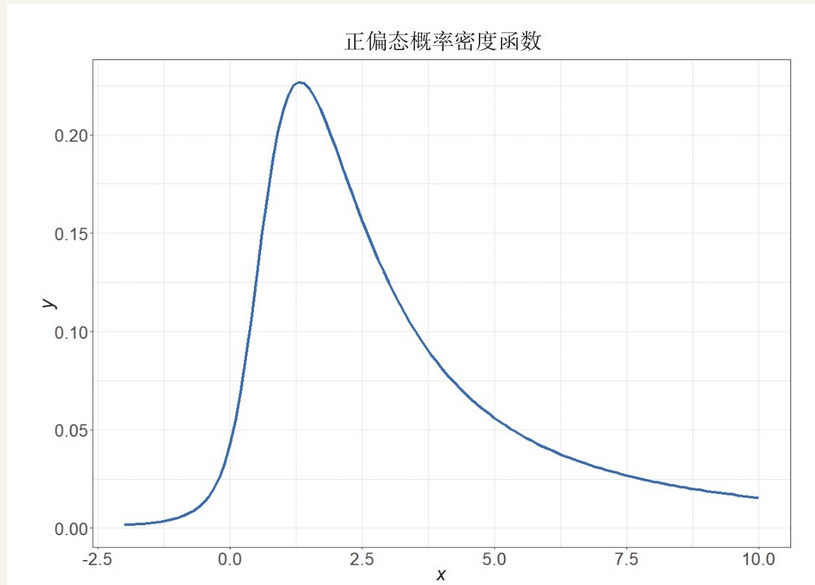

左偏（负偏）态时，中位数大于期望

#### (9) 常见分布的期望和方差是什么？

这个问题在面试中可能不会以这种形式被问到，但是掌握它们对相关内容的学习有很大的帮助作用。
对于离散型随机变量，如表3-1所示。

对于连续型随机变量，如表3-2所示。

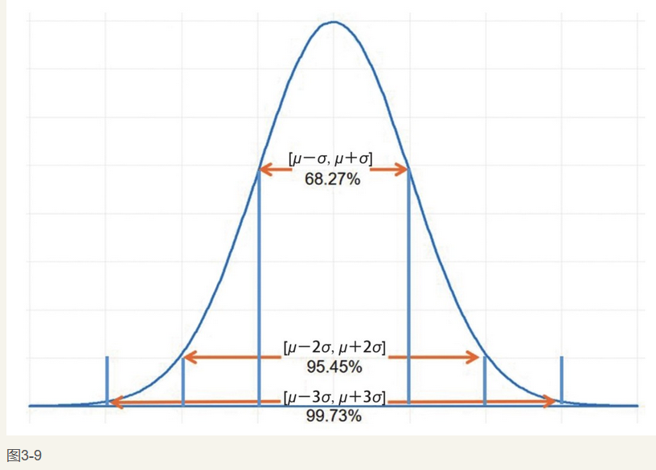

#### (10)如何给没有学过统计学的人解释正态分布。

**正态分布像一只倒扣的钟。两头低，中间高，左右对称。大部分数据集中在平均值，小部分在两端。**

正态分布也称“常态分布”，又名“高斯分布”，在实际工作中使用得最多，也是面试中考查的重点。正态分布的概率密度函数图形如图3-9所示。

**3σ方法与正态分布之间存在怎样的关联？**
68.27%、95.45%、99.73%的概率会使样本分别落在[μ-σ，u+σ]、[μ-2σ，u+2σ、[μ-3σ，u+3σ]区间。3σ就是基于此而产生的，在有些面试中也会对这个概念进行考查。样本落在3σ之外的概率只有0.27%，这部分误差不再属于随机误差，而是粗大误差，应该将这部分数据予以剔除。

#### (11) 列举常用的大数定律及其区别。

#### (12) 简述中心极限定理。

假设一组随机变量相互独立且同分布，当n足够大时，均值的分布接近于正态分布

**中心极限定理作用：**
（1）在没有办法得到总体全部数据的情况下，我们可以用样本来估计总体。
（2）根据总体的平均值和标准差，判断某个样本是否属于总体。

#### (13) 简单简述假设检验的原理。

**小概率反证法。**即为了检验一个假设是否成立，我们先假设它成立，在原假设成立的前提下，如果出现了不合理的事件，则说明样本与总体的差异是显著的，就拒绝原假设，如果没有出现不合理的事件，就不拒绝原假设。

这里所述的不合理的事件指的就是小概率事件，通常情况下我们认为一个小概率事件基本上不会发生，如果发生了，说明它就不是一个小概率事件了，所以要拒绝原假设。

在假设检验中原假设和备择假设选择的依据。

#### (14) 简述假设检验的两类错误。

第I类错误：**弃真**，原假设为真，却被我们拒绝了。
第II类错误：**取伪**，原假设为假，却没被拒绝。

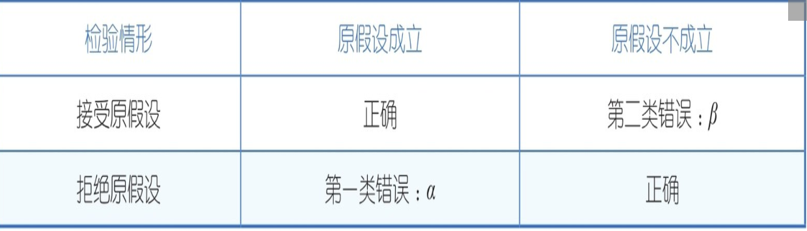

#### (15)  如何平衡这两类错误？

我们要尽可能地将犯两类错误的概率降到最低。但是，在样本容量固定的前提下，减少犯第I类错误的概率，必然会增加犯第II类错误的概率，一般来说，我们总是先控制犯第I类错误的概率，使它不大于显著性水平。而犯第II类错误的概率依赖于样本容量的大小，因此对样本容量的选择上，也要有所考量。

#### (16) 简述假设检验中的p-value、显著性水平、置信度、检验效能。

● p-value：在原假设成立的前提下，检验统计量出现当前值或者更为极端的值的概率。
● 显著性水平：在假设检验中，犯第一类错误的上限，用α表示。
● 置信度：用1-α表示检验的置信度。
● 检验效能：规避第二类错误的概率，用power表示。

#### [(17) 分别解释z检验和t检验](https://zhuanlan.zhihu.com/p/49468324)

#### (18) 贝叶斯派统计和频率派统计的区别

**频率派的观点**中，样本所属的分布参数θ虽然是未知的，但是固定的，可以通过样本对θ进行预估得到 ˆθ。
**贝叶斯派则认为**参数θ是一个随机变量，不是一个固定的值，在样本产生前，会基于经验或者其他方法对θ预先设定一个分布π（θ），称为“先验分布”。之后会结合所产生的样本，对θ的分布进行调整、修正，记为π（θ|x_{1}，x_{2}，x_{3}，…），称为“后验分布”。
贝叶斯统计的很多内容都是按照先验分布和后验分布而展开的，在贝叶斯统计思想中，很重要的一部分就是基于已经产生的样本调整分布，其中应用了一个重要的概念：条件概率。

#### [(19) 贝叶斯定理和全概率公式的应用](https://zhuanlan.zhihu.com/p/78297343)

#### [(20) 用贝叶斯定理解释”三门问题“。](https://www.zhihu.com/question/26709273/answer/215247275)

### 1.1.2 数据挖掘：

#### （1）数据集的划分方式，以及各种数据集的作用。

在数据挖掘中，通常将数据集分为三类：训练集、验证集合测试集，如上图所示。

- 训练集：结果已知，用于模型训练拟合的数据样本，在实际应用中这部分数据往往会占总体样本的70%~80%。
- 验证集：结果已知，不参与模型的训练拟合过程，用于验证通过训练集得到的模型效果，同时对模型中的超参数进行选择。
- 测试集：结果未知，最终利用模型输出结果的数据集。

这三部分构成了模型的整体数据集。模型上线后，输出模型在测试集上的结果，并与最终的实际结果进行对比。测试集后续可以转化为训练集或者验证集，实现模型的不断迭代和优化。

#### （2）简述欠拟合和过拟合，并解释产生的原因以及解决方案。

**欠拟合**（**underfitting**）是指相较于数据而言，模型参数过少或者模型结构过于简单，以至于无法捕捉到数据中的规律的现象。

:smile:欠拟合主要产生的原因：模型复杂度过低，无法很好的去拟合所有的训练数据，导致训练误差大。

1. 增加模型复杂度，尝试使用核SVM、决策树、深度神经网络（DNN）
2. 增加新特征，增加假设空间
3. 如果有正则项，可以调小正则项参数

**过拟合**的定义：<!--我们的数据在训练集上可能很好的表现，但是在遇到新的数据后，表现就没有那么出色了，这种现象叫过拟合。-->

:smile:过拟合主要产生的原因：**模型复杂度过高**，训练数据少，训练误差小，**但是测试误差大**

1.  增加训练数据可以有限的避免过拟合
2.  正则化，L1、L2；如果有正则项，则考虑增大正则项参数
3.  交叉验证
4.  特征选择，减少特征数或使用较少的特征组合

模型训练所要做的就是平衡过拟合和欠拟合，通过在验证集中的验证工作，选择合适的超参数，最终降低误差。

#### （3）选择更加复杂的模型进行调参是否能有更好的结果？

答案是否定的。随着模型复杂度的增加，会使模型出现过拟合现象，这同样会导致误差的增加。

#### （4）常用的模型分类方法，以及其中重要的模型（监督/非监督、参数/非参数等）有哪些。

比较通用的**模型分类方法**是根据训练样本是否带有标签分为监督学习和非监督学习.

- 训练数据既有特征(feature),又有标签(label),则成为监督学习
- 只有特征，没有标签，则为非监督学习。

在数据挖掘中，模型也可以分为参数模型和非参数模型。

#### （5）阐述参数模型和非参数模型的区别及各自优缺点。

<!--线性回归模型在训练前就会确定y=a_{0}+a_{1}x_{1}+a_{2}x_{2}+…这样的形式。而非参数模型在训练前并没有对目标函数限定其形式，它是通过训练不断修改目标函数的形式的。-->

常见的**参数模型**包括线性回归模型、逻辑回归模型、朴素贝叶斯模型。

- 其优点是具有很强的可解释性、模型学习和训练相对快速，以及对数据量的要求比较低，不需要特别大的训练集。
- 其缺点是需要提前对目标函数做出假设，而现实中的问题是很难真正应用某一目标函数的，特别是一些复杂的问题，无法用参数模型得到很好的训练拟合。并且参数模型的复杂度往往偏低，容易产生欠拟合现象。

常见的**非参数**模型有SVM模型、决策树模型、随机森林模型等。

- 优点：非参数模型对目标函数的形式不做过多的假设，学习算法可以自由地从训练数据中学习任意形式的函数。由于不存在模型的错误假定问题，可以证明，当训练数据量趋于无穷大时，非参数模型可以逼近任意复杂的真实模型，因此在数据量大、逻辑复杂的问题中效果好于参数模型
- 缺点：在非参数模型中有很多超参数需要选择，因此与参数模型相比，非参数模型会变得更加复杂，计算量更大，**对问题的可解释性更弱。**

很多时候神经网络模型都被归类为半参数模型。
模型除了可以分为参数模型和非参数模型，还可以分为生成模型和判别模型。

#### （6）简单介绍生产模型和判别模型的概念。

**生成模型**：:smiley:

1. 学习得到联合概率分布P（x，y），即特征x和标签y共同出现的概率，
2. 然后求条件概率分布，能够学习到数据生成的机制。
3. 常见的生成模型包括朴素贝叶斯模型、混合高斯模型、隐马尔可夫模型等。

**判别模型：**

1. 则学习得到条件概率分布P（y|x），即在特征x出现的情况下标签y出现的概率。
2. 常见的判别模型包括决策树模型、SVM模型、逻辑回归模型等，我们使用的大部分模型都是判别模型。

生成模型需要的数据量比较大，能够较好地估计概率密度，而判别模型对数据量的要求没有那么高。在数据量比较充足的情况下，生成模型的收敛速度比较快，并且能够处理隐变量问题。相比于判别模型，生成模型需要更大的计算量，准确率及适用范围也弱于判别模型，所以在实际工作中还是以使用判别模型为主。

#### （7）模型中参数和超参数的区别。

​       模型中同时有参数和超参数，二者最大的区别在于：

- 参数是通过模型对训练集的拟合获得的 :smile_cat:

  <!--如最简单的线性回归模型y=ax+b中的a、b分别表示的斜率和截距，就是通过模型训练获得的，该模型就是典型的参数模型。-->

-  而超参数无法通过模型训练获得，在模型训练前需要人为地给出超参数，

  <!--如决策树模型的深度、随机森林模型中树的数量等，它们只能通过在验证集中进行验证，并进行最终的选择。-->
         在数据挖掘项目中，模型调参是一个非常重要且比较耗时的工作。实际上，调参指的是调整超参数。很多时候，需要针对一些复杂的模型（如神经网络模型）进行大量的调参工作，而且需要对其所带来的效果提升与调参工作量进行权衡。在学习、竞赛中，要尽量选择效果最好的模型；而在工作中，则会综合考虑模型效果、实现的复杂度以及时间等来进行选择。

### (8) 常见的模型介绍

#### 1.线性回归模型

线性回归模型是利用数理统计中的回归分析，来确定两个或两个以上变量间相互依赖的定量关系的一种统计分析方法，应用十分广泛。其表达形式为y=w′x+e，其中w为参数行列式，e为随机误差，且服从期望为0的正态分布。对于随机误差，有一些假设需要了解。

##### Q_1：在线性回归模型中对随机误差做出的假设有哪些？

1. 随机误差是一个期望或平均值为0的随机变量；
2. 对于解释变量的所有观测值，随机误差有相同的方差；
3. 随机误差彼此不相关；
4. 解释变量是确定性变量，不是随机变量，与随机误差彼此相互独立；
5. 随机误差服从正态分布。

<!--在回归分析模型中，如果只包含一个自变量和一个因变量，那么将其称为一元线性回归分析模型。如果在回归分析模型中包含两个或两个以上的自变量，则称其为多元线性回归分析模型。-->

<!--很多候选人认为线性回归模型是比较简单的一种数据分析和挖掘方法，没有花足够的时间来真正理解它。实际上，在数据分析师的工作中会大量使用线性回归模型，该模型具有使用方便、可解释性强的特点，能够满足公司很多敏捷分析的需求。-->

##### Q_2：线性回归模型有哪些常用的提升效果的方法？

**一是引入高次项。**某些因变量与自变量本身并不存在线性关系，但是与其二次项或者更高次项存在线性关系，此时就需要引入高次项。需要注意的是，在引入某自变量的高次项之后，需要保留其相应的低次项。引入高次项后的效果如图3-19所示。

**二是引入交互项。**一个预测变量对模型结果的影响，在其他预测变量有不同值的时候是不同的，这称为变量之间的交互关系。引入交互项的方式通常是将两个预测变量相乘放入模型中作为交互项。将一个交互项放到模型中会极大地改善所有相关系数的可解释性。在引入交互项之后，需要保留组成交互项的自变量。

##### Q_3：简述线性回归模型的优缺点。

- 线性回归模型的**优点**在于快速，能够处理数据量不是很大的情况，并且具有很强的可解释性，可以有效指导业务部门进行决策。
- **缺点:**由于线性回归模型不是一种很复杂的参数模型，需要提前对目标函数进行假设，当数据量增加、问题变得复杂时，线性回归模型往往无法进行很好的处理，此时就需要使用其他更加复杂的模型。

#### 2.逻辑回归模型

逻辑回归模型与线性回归模型有许多相似之处，但是也有所区别。

##### Q_1：逻辑回归模型与线性回归模型的区别是什么？:smile:

在对最终结果y的处理上，在逻辑回归模型中，会将此前线性回归模型中的y通过sigmoid函数（又称逻辑回归函数）映射到[0，1]区间。逻辑回归模型**主要用于解决二分类问题**，而非预测问题，这也是逻辑回归模型与线性回归模型在应用中**最大的区别。**
在逻辑回归模型中，为了避免过拟合，需要引入正则化方法，常用的有L1与L2方法，二者间的**区别也是考查内容。**

##### Q_2：在逻辑回归模型中常用的L1与L2方法的区别在哪里？

<!--通过引入惩罚项，使得逻辑回归模型中各个变量的系数得以收缩，从而避免过拟合的发生。常用的正则化方法有lasso方法（也叫L1方法，惩罚系数的绝对值，惩罚后有的系数直接变成0，其他系数绝对值收缩）和ridge方法（也叫L2方法，惩罚系数的平方，惩罚后每个系数的绝对值收缩）。-->

**相比于L2方法，L1方法可以筛选变量，在变量较多的情况下，能够从中选择较为重要的变量。在实际工作中应根据需要来选择使用L1与L2方法。**
除了正则化方法，sigmoid函数也是非常重要的。通过sigmoid函数，能够将y从整个实数空间映射到[0，1]区间。sigmoid函数的定义为

映射效果如图3-20所示。

##### Q_3：简述逻辑回归模型的优缺点。:smiling_imp:

逻辑回归模型通常用来解决二分类问题。对于多分类问题，需要用softmax函数替代sigmoid函数，softmax函数可以针对各个分类输出概率值，概率值之和为1。

**优点:**逻辑回归模型具有可解释性强的特点，在一些对可解释性有很高要求的领域，如金融、银行等，逻辑回归模型有着广泛的用途。

**缺点:**与线性回归模型相同，随着数据量的增加，逻辑回归模型会产生欠拟合现象，此时需要选择一些非参数模型进行训练。

#### 3.决策树模型

决策树模型是一种非参数模型，它无须对目标函数和变量做过多的假设，使用更加灵活，能够处理更加复杂场景下的问题。

对于决策树模型，每一步分支的选择以及节点的确定都需要关心，在面试中经常会考查这部分内容。

##### Q_1：如何确定每一个节点选择什么特征，其常用方法及各自特点是什么？

 ID3   使用信息增益作为特征选择的度量 
 C4.5  使用信息增益**率**作为特征选择的度量

常用方法有ID3和C4.5。每一步特征的选取都是基于信息熵的，通过在节点上生成新的分支来降低信息熵。
在信息论中，信息熵用来表示随机变量的不确定性，其定义为：

对于决策树模型，pi表示样本落在各个叶子节点的概率，且

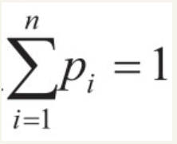

当n=2，p_{1}、p_{2}均为1/2时，信息熵达到最大值；当p_{1}=1或p_{1}=0时，信息熵为最小值。在决策树模型中，每一步都会选择合适的特征作为节点，降低信息熵。
还有CART 方法，它用Gini 系数（也称为Gini 不纯度）代替信息熵，

:smile:它在选择特征时，会选择能够使Gini不纯度变小的特征作为节点。
        CART支持预测连续值（回归），相比于ID3、C4.5只能处理分类问题，CART可以同时处理分类问题和预测问题，并且能够处理连续值（ID3不能处理连续值，C4.5虽然可以处理连续值，但是比CART要复杂得多）。因此，**在实际工作中CART的应用更为广泛**，Python中**sklearn默认的决策树模型也是用CART**来选择分支的。

##### Q_3：简述ID3和C4.5方法的异同点。

​      ID3在选择特征时，会选择能够使信息增益g（D，A）最大化的特征作为节点，g（D，A）=H（D）-H（D|A），其中H（D）为决策树模型的当前信息熵；H（D|A）为新的节点产生后的信息熵。ID3存在的问题在于会选择有比较多分支的特征作为节点，造成模型的过拟合。
​     相比于ID3，C4.5将单纯地考虑信息增益最大化变成了考虑信息增益比最大化，

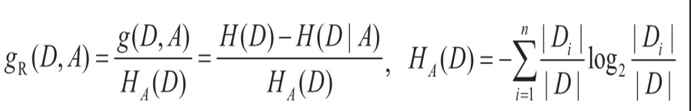

其中

表示样本在节点各个分类数量上的占比。随着分支数量的增加，HA（D）会变大，信息增益比g_{R}（D，A）会相应地变小。因此，C4.5会避免选择有过多分支的特征作为节点。

##### Q_4：简述决策树模型的优缺点。

**优点:**

- 决策树模型本身属于非参数模型，相比于线性回归模型和逻辑回归模型，它不需要对样本进行预先假设，因此能够处理更加复杂的样本。
- 它的计算速度较快，结果容易解释，可以同时处理分类问题和预测问题，并且对缺失值不敏感。
- 决策树模型具有非常强的可解释性，通过绘制分支，可以清晰地看出整体的模型选择流程，快速发现影响最终结果的因素，能够指导业务快速进行相应的修改、调整。

**缺点:**

​       决策树模型是一种“弱学习器”，即使通过调优方法进行了优化，也仍然容易产生过拟合的现象，造成最终结果误差较大，并且在处理特征关联性比较强的数据时表现得不是很好。

#### 4.随机森林

在讲解随机森林之前，先介绍一些概念。首先介绍强学习器和弱学习器。

##### Q_1：强学习器和弱学习器的定义以及划分的依据是什么？:smiley:

​        可以将学习器理解成模型算法。强学习器和弱学习器实际上是一个**相对的概念**，并没有很明确的划分界限，体现在学习器对复杂数据场景的处理能力上，相比于决策树模型，随机森林可以称为强学习器，但是和其他更复杂的模型比，它就是弱学习器了。

通过集成的方法，可以将多个弱学习器构造成一个强学习器，这称为**模型集成。**

##### Q_2：解释模型集成和模型融合的概念，并举出相应的例子。

​        模型集成是指将多个弱学习器（也称为基模型）进行组合，以提高模型的学习泛化能力。随机森林模型将多个决策树模型组合到一起，类似于随机森林这种将相同种类模型进行集成的模型，称为同质集成模型。相反，将不同种类模型进行集成的模型，称为异质集成模型。

<!--目前常用的模型集成方法有Bagging和Boosting，随机森林和GBDT是各自的代表，后续会讲解二者各自的集成方法和区别。-->

模型融合是基于模型集成而产生的概念。在模型集成中，需要将各个基模型的结果进行组合，得到最终的结果，这个过程称为模型融合。常用的模型融合方法如下。
● 平均法：在预测问题中，将各个基模型的结果进行平均作为最终结果。
● 投票法：在分类问题中，选择基模型中预测比较多的类别作为最终结果。

##### Q_3：解释随机森林的基本原理。

随机森林是模型集成中Bagging方法的典型代表，通过对样本或者变量的n次随机采样，就可以得到n个样本集。对于每一个样本集，可以独立训练决策树模型，对于n个决策树模型的结果，通过集合策略来得到最终的输出。需要注意的是，这n个决策树模型之间是相对独立的，并不是完全独立的，训练集之间是有交集的。
可以通过Bootstrap Sample（有放回采样）方法实现对样本的随机采样，基于公式

每次采样大约会有63.2%的样本被选中。该方法同样适用于对变量进行随机抽取

##### Q_4：相比于决策树模型，随机森林模型为何能实现更好的效果？

​       实际上，这个问题的回答也适用于所有的集成方法。前面提到，模型误差包括偏差和方差两个部分，

1. 假设各个决策树模型有相同的偏差和方差，通过将多个决策树模型得到的结果进行平均或者投票，
2. 可以保证随机森林模型的偏差与单个决策树模型的偏差基本相同。
3. 但是由于各个决策树模型之间的相对独立性，通过对结果进行平均或者加权能够**大幅度**减小随机森林模型的方差，最终将误差变小。

#### 5.Boosting模型

Boosting模型是将多个决策树模型集成后的一种模型。在面试中经常考查随机森林模型与Boosting模型之间的区别，**需要重点关注。**:stuck_out_tongue_winking_eye:

##### Q_1：阐述随机森林模型与Boosting模型之间的区别。

随机森林模型与Boosting模型分别运用了模型集成中的Bagging和Boosting方法，它们最大的区别在于，

- **随机森林**模型的各个决策树模型的生成是**相互独立**的，是基于通过样本重采样方法得到不同训练集而产生不同的决策树模型的；(并行?)
- 而**Boosting**模型中新的决策树模型生成是基于此前已经生成的决策树模型的结果，所以决策树模型的生成并不是相互独立的，每一个新的决策树模型都**依赖**前一个决策树模型。(穿行)

##### Q_2：常见的基于决策树模型的Boosting方法及各自原理是什么？

常见的基于决策树模型的Boosting方法包括AdaBoost和GBDT两种，它们的区别在于：

- AdaBoost会加大此前决策树模型中分类错误的数据的权重，使得下一个生成的决策树模型能够尽量将这些训练集分类正确；

- 而GBDT则是通过计算损失函数梯度（gradient）下降方向，定位模型的不足而建立新的决策树模型的。

  在实际工作中**后者的应用更加广泛。**

##### Q_3：简述随机森林模型和GBDT模型的优缺点。

在实际工作中，随机森林模型和GBDT模型都有着广泛的应用，它们都是基于决策树模型的，所以能够处理离散型变量和连续型变量同时存在的场景。它们不需要对数据集做过多的假设，能够处理比较复杂的问题。

1. 随机森林模型和GBDT模型都是集成学习方法，相比单一的决策树模型，其性能有了很大的提升。
2. 但是随机森林模型和传统的Boosting模型面对更大的训练集时，**依然存在训练速度较慢的问题**，因此就需要寻找更加快速的方法。

#### 6.XGBoost模型

​     上面提到了AdaBoost和GBDT，它们属于比较基础的Boosting模型。目前常用的则是XGBoost模型，它是一种性能更好的Boosting模型。
​      在实际工作中，XGBoost模型有着非常强的实用性，很多候选人在简历中都会写上使用XGBoost模型进行数据挖掘的经验。**在面试中也会对XGBoost模型进行考查，因此需要了解其基本原理以及性能提升的原因。**:smile:

##### Q_1：简述XGBoost基于GBDT模型优化的原因。

XGBoost（eXtreme Gradient Boosting）是Gradient Boosting方法的高效实现，它在传统GBDT模型的基础上对算法做了以下调整。

- 传统的GBDT模型以CART树作为基学习器，而XGBoost还支持线性分类器，这时XGBoost的基学习器可以是L1和L2正则化的逻辑回归模型或者线性回归模型，提高了模型的应用范围。

- 传统的GBDT模型在优化时只用到了损失函数一阶导数信息，而XGBoost则对损失函数进行了二阶泰勒展开，得到了一阶导数和二阶导数，可以加快优化速度。

- XGBoost模型在损失函数中加入了正则项，用于控制模型的复杂度。从权衡方差和偏差的角度来看，它降低了模型的方差，使学习出来的模型更加简单，可以防止过拟合，提高了模型泛化能力。这也是XGBoost模型优于传统GBDT模型的一个特性。

- 借鉴随机森林模型对特征进行采样的方法，在生成决策树的过程中支持列抽样，不仅可以防止过拟合，还能减少计算量。

-  能够自动处理缺失值，将其单独作为一个分支。

  <!--以上5点是XGBoost模型在算法层面的改进，同时它在性能上也有了很大提高，在大数据量的处理上能够更进一步地提高计算效率，提升速度（主要因为支持并行）。-->

##### Q_2：简述XGBoost的并行操作。

​         XGBoost的并行不是指在模型上并行，它也是一次迭代完成后才能进行下一次迭代的，而是指在**特征上并行**。决策树模型的学习最耗时的一个步骤就是对特征值进行排序（因为要确定最佳分割点）。

​        XGBoost模型在训练之前，预先对数据进行了排序，然后保存为块（block）结构，在后面的迭代中会重复使用这个结构，大大减少了计算量。块结构也使得并行化成为可能。此外，在进行节点选择时，需要计算每个特征的增益，最终选择增益最大的那个特征作为节点，各个特征的增益计算就是基于块结构实现并行操作的。

### (9) 模型效果评估方法

<!--前面介绍了模型的基本概念以及一些常见的模型。此外，如何评估一个模型的效果也是很重要的。本节会介绍一些常见的模型评估方法，分为预测问题和分类问题进行阐述。-->

#### Q_1：对于预测问题常用的评估方法有哪些？

如下是一些常用的评估方法。

-  MSE（Mean Squared Error，均方误差）：参数估计值与参数真值之差平方的期望值。MSE可以用于评估数据的变化程度，MSE的值越小，表示模型的精确度越高。

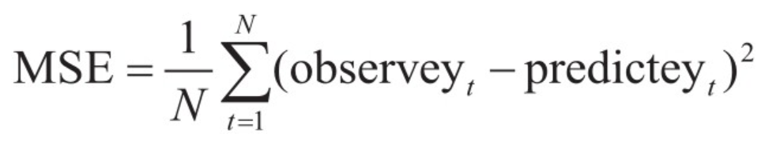

- RMSE（均方根误差）：均方误差的算术平方根。

-  MAE（Mean Absolute Error，平均绝对误差）：绝对误差的平均值。平均绝对误差在一些问题上能更好地反映预测值误差的实际情况。

  

以上三种是比较通用的预测问题的评估方法，需要根据具体的问题选择合适的方法。

#### Q_2：对于二分类问题常用的评估方法有哪些？

关于分类问题，需要分成二分类问题和多分类问题分别进行讨论。对于二分类问题，常用的评估方法如表3-6所示。

<!--表3-6中的正例和反例是相对的概念。正例通常是我们所关注的结果，比如针对订单的完成率进行研究时，顺利完成的订单就是正例；而如果对订单的失败率进行研究，则会将失败的订单作为正例。-->

#### Q_3：解释准确率和召回率。

**准确率（precision）：**:smile:

又称“精度”，判断为正例且实际上是正例的数量/判断为正例的数量，即TP/（TP+FP）。
**召回率（recall）：**

又称“查全率”，判断为正例且实际上是正例的数量/实际上所有正例的数量，即TP/（TP+FN）。
准确率和召回率是二分类问题中十分重要的评估指标，同时需要对准确率和正确率进行区分。

#### Q_4：简要解释正确率，并阐述正确率与准确率的区别。

​        正确率（accuracy）是指判断正确的数量，即（TP+TN）/（TP+FN+FP+TN）。相比于准确率，正确率同时考虑了正负样本预测的情况。在实际问题中大多是对正样本比较感兴趣，并且会存在正负样本不平衡的情况，在极端情况下正负样本比例会达到1∶999。此时如果要看正确率，只需将所有结果都预测为负样本，正确率就达到了99.9%，但准确率为0。因此，相比于正确率，准确率的使用频率更高。
PR曲线是用来可视化模型准确率和召回率的图形。在实际工作中，通常固定某一个指标，比如固定20%的召回率，然后在此基础上提高准确率。准确率、召回率随阈值的变化情况如图3-22所示。

由于准确率和召回率是十分常用的评估指标，在面试中被问到的概率也非常高。

#### Q_5：用简洁的语言或者举例解释准确率和召回率。

这里用警察抓小偷的例子进行解释。由于问题中需要关注的是小偷部分，所以将小偷的样本划为正例，将 :smile:

- 准确率解释为在抓到的人中小偷的占比，
- 将召回率解释为在所有小偷中被抓到的占比。

除了PR曲线，还有一个用来刻画二分类问题的图形，就是ROC曲线，如图3-23所示。ROC曲线的横纵坐标如下。
FPR(False Positive Rate):TP/TP+FN
TPR(True Positive Rate):FP/TN+FP

在ROC曲线中，一个十分重要的概念就是AUC。（Area Under Curve）被定义为ROC曲线下的**[面积](https://baike.baidu.com/item/面积/100551)**

#### Q_6：简单介绍ROC与AUC的概念及相互之间的关联。

​      ROC曲线一定会经过（0，0）和（1，1）两个点，在此基础上要尽量使曲线下方所围成的面积最大化，这部分面积称为AUC。AUC也是用来衡量二分类模型效果的指标。由于AUC是一个非常直观的数值，在金融类或者其他一些比较需要强解释性的问题中，它会被经常用到。

#### Q_7：多分类问题的评估方法有哪些？

​       一种评估方法是将多分类问题转换为二分类问题，将其中我们最关心的分类作为正例，其余的均作为负例，这样就可以运用二分类问题的评估方法了，如PR曲线。
​       还有一种常用的方法就是使用混淆矩阵。混淆矩阵是将此前的2×2预测值与实际结果之间对应的矩阵进行扩展，扩展成n×n矩阵，其中n表示分类的数量，如图3-24所示。在混淆矩阵中，对角线代表正确的结果。

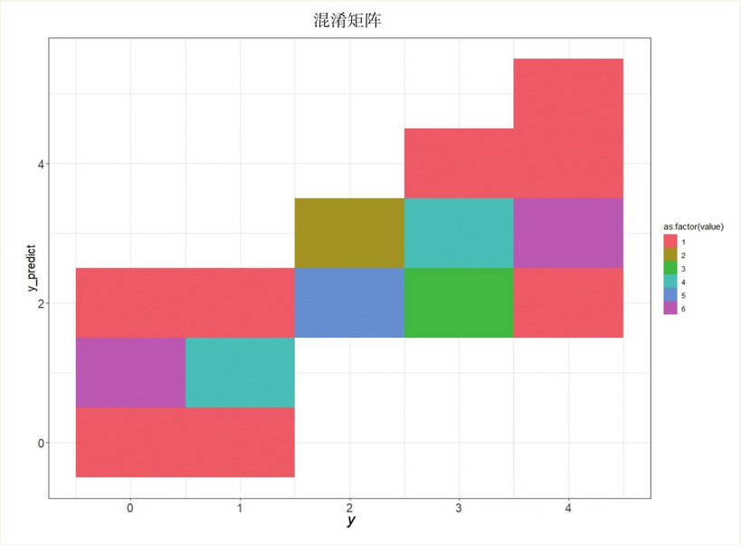

注的是模型整体的分类效果，则可以用正确率来进行描述。二分类问题实际上是多分类问题的一种特殊情况。
本节内容总结如图3-25所示。

​        以上列举的知识一部分问题，其中每个问题又可以衍生出许多不同的问题。不同于在学校的考试中比较重视原理以及相关证明，在面试中对知识点的考查，通常是希望候选人对这些知识点能够融会贯通，用通俗易懂的语言进行简述。

​       比如对准确率和召回率的解释，虽然可以利用定义中的表格和相关概念进行简述，但是如果能够做到融会贯通，利用警察抓小偷的案例进行简述（将准确率解释为在抓到的人中小偷的占比，将召回率解释为所有小偷被抓到的占比），显然比单纯第背诵概念好得多，即体验出专业性，又体现出自己的思考。

​       建议：对于这部分的内容，一定要和未来的工作场景相结合，这样才能体现出你对它们的真正的理解。

## 1.2 编程能力考查:smile:

​      不同于基础知识考查，编程能力考查更多的是需要候选人**现场进行编程**一—可能在专门的代码考核程序上进行，也可能直接用纸笔来写代码。所考查的编程语言会根据候选入筒历中的内容和岗位而定。

​       对于数据分析师而言 ， 对 R、Python 主要考查的是写**数据框**相关的操作， 包括列的增加、删减、汇总以及数据框之间的连接操作等。这部分考查的内容比较直观，而且数据框也是数据分析师在工作中接触最多的对象。另外，也会对比较复杂的循环、函数进行考查，要求候选人完成循环语句或者功能函数，这部分考查结合了统计学的一些知识和逻辑思维

​       对 SQL 则主要考查数据提取和表之间的计算，需要候选人在掌握基本的SQL 语句、聚合函数，表连接的同时，着重了解窗口函数以及对数据倾斜的处理方法。窗口函数和数据倾斜被考查到的概率很大。

​       注意，在编写代码时—定要**规范、整齐、注释合理**。考查编写代码，一是看候选人对编程是否熟悉；二是看候选人是否有良好的编程习惯，能否遵狟一定的规范。有些候选人虽然有丰宫的工作经验，但是在编程方面却没有养成良好的习惯，这在面试中也是—个扣分顶。

​       此外，面试官也会对项目中用到的—些包或者函数的细节进行考查，一是看候选人是否真的参与了这些项目；二是看侯选人对细节的掌握情况。这就要求候选人要重视项目细节，并且能对项目进行复盘。

## 1.3 实战项目考查

​       实战项目考查主要分两郘分：一是对候选人做过的项目进行了解；二是对业务常识进行考查。常见的面试问题如下：

• 筒单做自我介绍。

• 阐述之前参与过的某个项目，并且举例说出遇到的困难和解决办法。

·对于之前敬过的顶目，还有哪些可进—步提升的地方。

• 近期 X X X  指标有所下降， 请针对该问题提出系统化的分析方法。

• 近期产品针对 X  X X  功能进行了改版， 如何评估改版的效果。

·公司最近举办了—个营销拉新活动，如何评估这次拉新的效果。

·在设计数据报表时需要考虑的地方。

• 常用的数据监控方法（如果在此前工作中有所涉及，则可以进行详细阐述）。

·用户画像的数据来源以及应用场景。

• 针对 X X X  业务，如何运用数据库中的用户画像数据。

• AB 测试所运用的数学原理。

• AB  测试流量划分的方法，以及最小样本量的计算方法。

- 做分析报告需要注意的点，可以展示之前做过的**脱敏**后的分析报告。
- 在做数据挖掘模型之前，需要进行哪些可行性分析。
- 特征工程包含的变量处理方法。
- 异常值和缺失值处理的方法。
- 如何评估模型上线后的效果。
- 近期看的书或者学到的新的数据分析方法。

   这部分是实战项目考查，在简述项目时要注意数据导向，流程明确，关注技术细节，对项目从开始构建到上线再到迭代的过程进行系统的梳理。

  这就要求候选人在做项目的过程中认真思考，真正理解项目背后的技术细节和业务逻辑，而非简单地完成需求。

关于AB测试、用户画像等知识，可以多看这方面的文章，了解目前业内先进的方法。

上面最后一个问题实际上是考查候选人的潜能、学习能力和态度，只有不断进行学习，才能在未来的工作中始终保持积极的态度，积极探索和掌握新的技术。

# 第5章 数据分析师实战技能

## 5.1 数据分析师工作必备技能

只有用心**思考**如何利用数据为公司创造并付诸实践，才是一个好的数据分析师应该做的。

书本网页版https://read.douban.com/reader/ebook/161971419/

### 5.1.1 数据人员如何创造价值

- 基于历史数据和业务背景构建指标体系或者模型。
- 基于指标体系，监控线上业务数据并制定相应的监控规则。
- 输出数据分析报告或者提供可执行策略，推动业务的发展。

### 5.1.2 完整的指标体系构建

#### Q_1：要构建一套指标体系，整体思路是什么？

1. 构建指标体系应该**“纵向”和“横向”**相结合
2. **纵向**指的是梳理出分析问题的整个流程，比如对于电商产品，需要分析出用户从进入网站到最终下单的整个流程；
3. 对于工具类产品，则需要关注用户使用过程中的体验以及用户流失情况。
4. 有了纵向分析的过程，还需要**横向**拓展不同的维度，如基于用户画像的人群分类、根据不同业务背景的时间拓展以及业务线的划分。
5. 最后将纵向和横向的结果相结合，就得到了一套完整的指标体系。

#### Q_2：用户行为的核心节点有哪些？如何有针对性地设计指标？

​        了解用户行为的核心节点，实际上就是**纵向**分析的过程。互联网公司大多针对C端用户进行分析，这里就以C端用户(consumer （消费者）)为例进行介绍。对于C端用户，核心的三个节点是新增、活跃、留存/流失，大多数分析都是围绕这三个节点进行的，整个流程如图5-1所示。

可以看到，针对新增、活跃、留存/流失这些节点，可以纵向设计出很多指标，但主要是绝对数量和百分比。

- 对于新增用户，指标有新增用户数量、新增用户留存率、新增用户活跃率等。
-  对于活跃用户，指标有活跃用户数量、活跃用户中的新增用户数量、活跃用户中的老用户数量等。
- 对于老用户，指标有老用户数量、老用户流失率、老用户唤醒率等。
- 对于流失用户，指标有流失用户数量、流失用户与新增用户比率等。

这样就可以针对用户的整体行为节点进行比较完整的指标设计，其中活跃用户部分是需要重点关注的，通过对从新增到流失整个流程指标的构建，可以清晰地看出在哪个环节最终活跃用户数增加了或者减少了。

#### Q_4：对于活跃用户，应该如何进行相应的指标设计及路径分析？

​        对于活跃用户，要研究其活跃行为，从而提高用户的体验。针对不同类型的产品，需要进行相应的细分设计。比如对于电商产品，需要关注的是从来访用户到用户最终成功支付的整个流程，如图5-2所示。

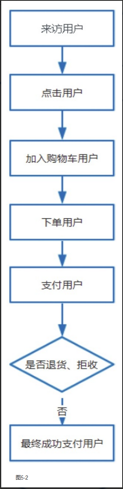

​        可以看到，针对这个**流程的每一步**都可以**统计出相应的用户数量以及上一步的转化率**，比如来访用户数量、点击用户数量、加入购物车用户数量、下单用户数量、支付用户数量、最终成功支付用户数量，以及各种转化率，如点击/曝光转化率、下单/点击转化率、下单/加购转化率、支付/下单转化率、成功支付/支付转化率。这些指标就构成了一个完整的纵向指标体系，通过这些指标可以清晰地看出哪个环节存在问题。

​      对于电商产品，除了要关心用户数量，**金额**也是要关心的指标。从加购开始，每个环节在用户数量的基础上都需要增加金额指标以及相应的客单价指标。

​       以上是对电商产品活跃用户的纵向分析。下面再举一个短视频的例子。对于短视频，需要分为**视频的观看者**和视频的发布者两个独立的用户群体进行分析。对于视频的观看者，需要考虑的是各种行为数据，相对路径比较短，如图5-3所示。

       

​       针对用户的这些行为设计相关的指标，比如观看视频的数量、整体时长、点赞视频占比、评论视频占比等，这些指标刻画了用户观看视频的体验情况。
​      对于**视频的发布者**，则需要关注整个流程，看在某个环节的转化上是否存在问题，造成发布的视频数量减少，如图5-4所示。

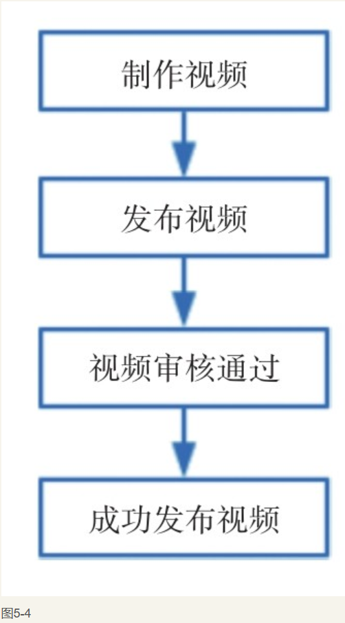

​        以上就是构建指标体系的纵向部分，其中包括了用户从新增到流失/留存的整个流程，这是比较通用的指标体系建立方法。同时针对一些产品的活跃用户进行了分析。大家在面试前需要对所要应聘部门的业务有所了解，梳理出产品中用户的生命周期以及活跃用户的行为情况。

#### Q_5：有了明确的用户行为路径及相关指标后，如何进一步分析？

​        除了纵向分析，还需要**横向**分析，横向分析是指对于同一个指标，基于不同的维度进行相应的拓展，常用的维度包括**时间维度**和**用户维度**。

#### Q_6：针对时间维度的分析，需要注意的点有哪些？

​       对于**时间维度**，常用的分析方法是关注最近一段时间的数据，**时间的长短要根据业务的具体特性来确定。**对于一些高频的App或者功能，通常关注最近1～7天的整体数据情况即可，也可以是自然周。对于一些相对低频的App或者功能，则需要将时间拉长，关注最近15天、30天、90天甚至更长时间的整体数据，也可以是自然月、季度甚至自然年。

​      另外，与时间维度相关的有**同比和环比**的概念。因为单纯地关注一段时间的数据并不能很好地看出趋势情况，需要与之前的数据进行对比。对于同比和环比的概念，在实际应用中不需要进行很明确的划分。常用的对比方法是对比当日与上日、本周与上周、本月与上月的数据。对于一些**周期性比较强**的产品，则需要先确定产品的周期，比如有些产品会受到周末的影响，此时比较合理的对比方法是用本日的数据与上周同一日的数据进行对比；有些产品会受到大型节假日的影响，此时针对节假日数据，就需要与上一个大型节假日的数据进行对比。

​       对于一些对实时性要求高的产品，需要将数据指标细化到小时级别。梳理后的时间维度分析方法如图5-5所示。

​       除了时间维度，还有一种常用的**拓展方法**，就是基于用户画像的用户维度进行拓展。用户画像是互联网公司中常用到的分析工具，通过用户画像可以**有效了解**各个群体的行为情况，也可以基于用户画像拓展出相应的指标。

#### Q_7：列举常用的用户维度拓展方法。

​       有很多通用的用户维度拓展方法，比如对于用户所在地，可以分为城市、省份，甚至华东、华南等大区；对于用户的基本属性，可以分为年龄、性别、职业等；对于用户使用的设备情况，可以分为终端类型、客户端版本、厂商、机型等；对于新老用户，也可以拓展出一些指标。对于新用户，需要关注的是用户来源渠道，通常分为自然新增用户、活动新增用户、广告新增用户等渠道，通过对渠道的划分，可以在一定程度上避免一些大型活动对新增用户分析带来的影响；对于老用户，根据用户的生命周期进行划分，通常分为有效用户、活跃用户、忠诚用户、沉睡用户和流失用户，可以对产品整体趋势有一个清晰的了解。
​      梳理后的用户维度拓展方法如图5-6所示。

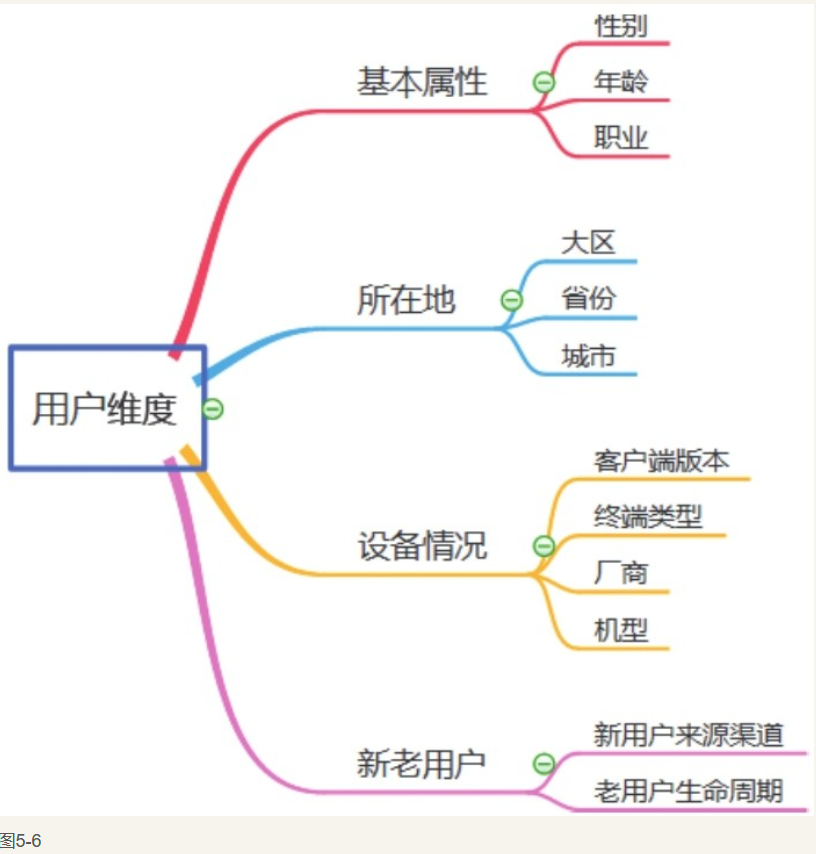

​        以上从纵向和横向两个方向讲解了如何构建一套完整的指标体系。在数据分析师岗位面试前，候选人需要**对所要面试公司的产品有一定的了解**，这样一方面可以进行有针对性的准备；另一方面也可以提前构建起一套指标体系。下面通过问题对前面的内容进行总结。

#### Q_8：×××最近有所下降，如何进行分析？

    针对这个问题，需要充分利用前面所讲的指标体系，按照如下步骤进行分析。
（1）梳理与该问题相关的流程，确定纵向指标体系。比如是支付金额有所下降，就需要梳理：曝光→点击→下单→支付这样完整的用户路径，以各个环节的转化率和用户量为核心指标。

（2）针对**核心指标**，**确定**所要对比的时间维度，比如基于所要分析的产品确定与前一天或者前一周的数据进行对比，发现问题所在。

（3）确定问题所在的环节后，针对该环节以用户维度进行拓展，如基本属性、所在地、设备情况、新老用户等，确定引起该问题的用户群体，并针对这部分用户进行相应的策略调整。
        除了上述问题，对于“新版产品或者某个运营活动上线后，如何评估效果”等问题，也可以采用相同的方法进行分析，只做微调即可。

​      总结起来，整个思路就是：梳理路径→确定对比的指标→选取对比的时间维度→针对问题环节拓展用户维度。
本节内容总结如图5-7所示。

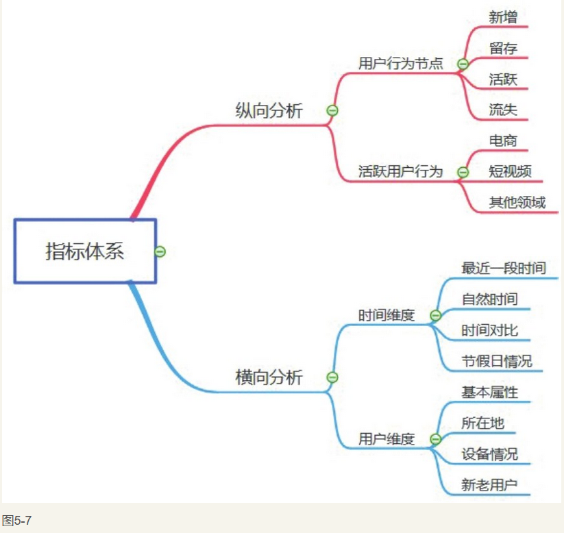

### 5.1.3 数据监控集报表设计

​        前面介绍了指标体系的构建，通过指标体系可以有效地指导产品人员和运营人员进行决策。但是真正执行时还需要基于指标体系来构建有效的数据监控体系，将指标体系落地，其最重要的产出就是报表。:dog:

#### Q_1：现在需要监控数据并设计相应的报表，应该考虑哪些问题？

​      说到报表，可能很多人会觉得没什么值得说的，无非是统计基本的数据，然后发送报表。有些获选人在简历上写的都是类似“整理和发送报表”这样的介绍，一笔带过。所谓工作经验就是机械式地整理和发送报表，而这样的工作经验并没有多大的帮助。**实际上，关于数据监控及相应报表的设计，有很多需要思考的地方，可以总结成三个问题：**<mark style=background-color:yellow>**看什么、怎么看、给谁看。**</mark>:smile:

​       监控数据和设计报表的基础就是前面构建的指标体系，但是仅仅将指标简单地罗列出来显然是不够的，下面就以一个产品的日常数据报表为例来介绍“看什么”。

#### Q_2：如何避免在报表中简单地罗列数字，提高信息量？

假如一个产品的基本数据报表如图5-8所示。

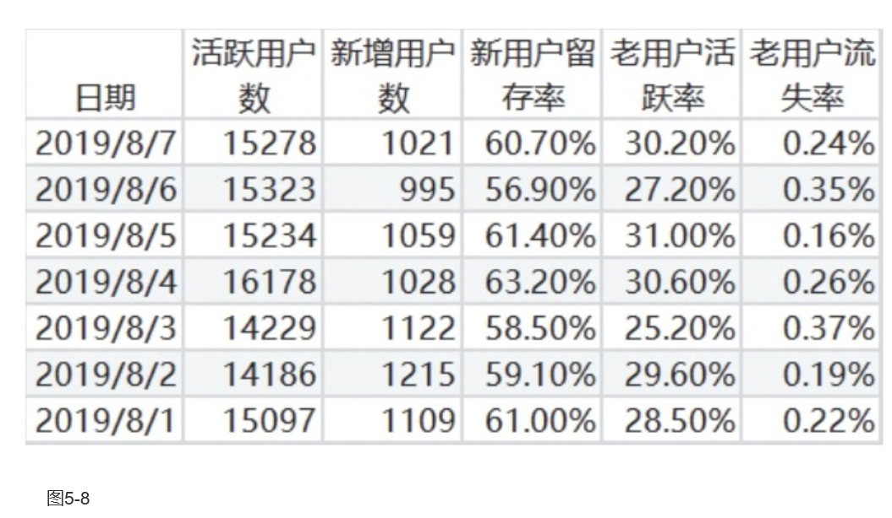

​       可以看到，这份报表中包含了活跃用户数、新增用户数、老用户流失率等指标，本书中这些数据是随机生成的，仅用于讲解。这样的数据报表给人的感觉更像是流水账，起不到任何对数据进行监控的作用，其中的指标是好还是不好，**不能很直观地看出来。**

​    因此，需要根据实际情况在报表中增加**对比数据**，与1天、7天或者30天前的数据进行对比，这样能够快速、直观地了解数据的变化。这里以增加周同比数据为例，如图5-9所示。

​       可以看到，增加了周同比数据之后，能够很快地通过报表数据清晰地了解指标的变化情况，相比于单纯地展示数据，可读性大大增加。同时，可以将周同比数据中低于5%、高于5%或者其他阈值的数据，用不同的颜色进行标注，通常用红色标注高于阈值的数据，用绿色标注低于阈值的数据，如图5-10所示。

​       可以看到，经过两次调整，报表的可读性得到了有效提升，同时增加了传递的信息量。在日常工作中应根据业务变化，不断地对报表内容以及数据监控的策略进行相应的调整，包括对比的数据和阈值等，以适应业务发展的需要。另外，报表不仅仅是表格形式，折线图、柱形图等图表也可以用作数据监控报表。
​      **在解决了“看什么”的问题后，接下来要考虑的就是“怎么看”。**

#### Q_3：常用的报表输出方式有哪些？

​        一种方式是通过**数据看板平台**输出，数据分析师将报表做好后放到数据看板平台，相关人员被授予权限后就可以看到。有些公司会采用自己研发的数据看板平台，也有些公司会使用开源的数据看板工具，比如Superset，数据看板效果如图5-11所示。

可以看到，Superset实现了许多不同类型的图表，并且可以按照需要进行组合。Superset可以直接连接MySQL数据库来获取数据，所以使用非常方便。

​        另一种方式是通过**邮件**发送报表。相比于数据看板，邮件报表所能传递的信息量要少一些；但由于邮件是日常工作中不可或缺的一部分，不同于数据看板需要主动关注，邮件报表属于“被动接收”，传递信息更加快速、直接，通常都会设置为定时任务，在固定时间发送报表给相关人员。
​        在解决了“看什么”和“怎么看”的问题后，接下来要考虑的就是“给谁看”，这是将报表功能最大化的核心问题。
​        报表的受众主要分为三类：**领导层、业务层和客户**，三者虽然都要关注报表数据，但是关注点不同，因此要基于各自的需要提供相应的数据和展现方式。

#### Q_4：针对不同的人群，如何设计相应的报表？:dog2:

-  领导层，提供给领导层的一定是**最核心**的指标数据，并且要采用**最直观的展现方式。**由于领导层每天要接收大量的来自不同业务线或者部门的信息，需要在**短时间**内获取最直观的业务数据，以便制定下一步的策略。因此，提供给领导层的通常是邮件报表，并且在邮件报表中选取最核心的指标数据，将变化趋势直观地表现出来，使领导层对核心数据的变化情况一目了然。(就是说不要弄花里胡哨的东西)

- 业务层，不同于领导层关注最核心的指标数据，业务层需要对所有的相关数据都能够做到**及时监控和分析**，因此提供给业务层的数据务**必要全面**，能够将各个维度的信息都展现出来。所以，通常将提供给业务层的数据集中展现在数据看板中，并且可以根据需要进行实时或者准实时更新，当数据出现波动或者异常时，能够第一时间通知到业务方进行排查。

- 客户，比如电商公司提供相应的报表给店铺或者供应商，指导其进行策略调整，也会采用数据看板，但是信息量会有所减少，因为要排除敏感数据和次要信息，主要围绕如何帮助他们**提高销售额或者达到其他目标而更加有针对性地展示相关数据**。

  如果在简历中提到有过设计报表的经历，那么在面试中通常会被要求介绍相关工作内容，因此需要候选人多多思考这方面的内容，避免给面试官留下“流水账”的印象。

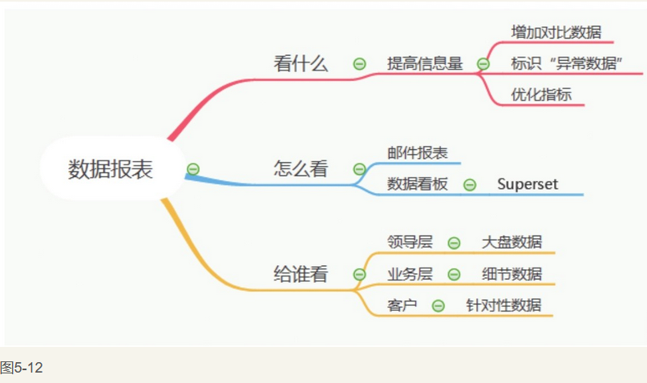

### 5.1.4 设计一份优质的数据分析报告

​        作为数据分析师，设计数据分析报告一定是日常必不可少的一项工作。通过数据分析报告，可以**有效地**分析现有产品或者某次活动的效果并对未来的决策提供指导。数据分析报告的**设计水平**，在一定程度上也能**反映出**数据分析师对**业务的理解水平**。
​       有些数据分析报告，类似于周报、月报等常规的报表，数据内容和规定相对固定，比如部门周会要看的数据周报，这样的数据分析报告更多的是让产品人员、运营人员和数据分析师针对近期数据形成统一的认知。这里要讲的数据分析报告，能够聚焦于某个点给出分析数据，比如新功能上线后的数据分析报告、运营活动效果的分析报告等。
​       关于数据分析报告的设计，需要考虑一个最核心的问题，就是如何提高质量。

#### Q_1：如何提高数据分析报告的质量？

​    （1）**明确整体分析思路**:smile:。好的数据分析报告都依赖于一个明确的思路，需要在开始设计报告前就整理出一个基本的框架，然后在设计过程中进行适当的添加。切勿在开始设计数据分析报告前不做规划，“边做边加”，否则效率会大打折扣。

​       举个例子，现在分析一次电商营销活动的效果，首先需要对分析维度进行拆解，如分为活动的整体效果、各个商品的销售情况、各类人群的销售情况。然后需要确定衡量这次活动的核心指标，如点击率（点击人数/曝光人数）、支付转化率（支付人数/点击人数）、点击单价（支付金额/点击人数）、客单价（支付金额/支付人数）等。
​      以上就是一次电商营销活动效果分析报告的设计思路，包含了对分析维度的拆解（也称为下钻）和核心指标的确定，有了一个清晰的框架，接下来就可以基于此进行数据的提取、分析以及可视化操作了。
​      整体分析结构如图5-13所示。

   （2）**结论提前，清晰明了。**在一份数据分析报告中，运营方和决策层最关心的就是结论以及相应的策略，这是报告中最有价值的部分。刚入职时，很多人会习惯按照因果关系的顺序来设计数据分析报告，即先给出论据，再给出相应的结论。这一点需要调整，通常数据分析报告的第一页或者文档的开头就要给出明确的结论。
       但也不是说简单地将所有的结论罗列出来就可以了，如图5-14所示。

​        这种结论看起来像流水账，出现了**太多的数据**，并且**很多是没有价值的**。比如男上装等四个品类的占比，这样的数据罗列毫无价值，而是应该给出和一个标杆进行对比的数据。再比如“女性用户整体指标符合预期”，其本身并不具有特别大的价值，在结论中应该主要关注那些变化比较明显的点。对结论进行合理的修改，修改后的结果如图5-15所示。

​       可以看到，剔除了一些无关紧要的数据，在整体结论中只放**最核心**的问题或者**闪光点**，并且给出相应的策略。
（3）注意图表的信息量。作为支撑分析的论据，需要在数据分析报告中使用大量的图表，但是很多时候会存在图表的信息量过少或者过多的情况—如果信息量过少，则无法很好地展示数据；如果信息量过多，则会影响他人的理解，无法直观地看数据。
以图5-15中提到的“男性用户点击率比平均水平低”这个点为例，证明这是造成男上装销售额偏低的主要原因，可以使用漏斗图，看各个环节的转化率，并且能够与历史数据进行对比，如图5-16所示。
​        可以看到，图5-16**清晰地**给出了男性用户各个环节的转化数据，并且有历史数据作为对比，能够将所需要证明的内容通过一页展示出来，其他人看的时候也非常直观，不会因为大量数据的堆积而影响理解。

## 5.2 基于互联网大数据的应用

### 5.2.1 A B 测试

​      目前在互联网公司中AB测试**具有不可替代**的作用，也是数据分析师需要掌握的重要技能。由于AB测试涉及很多**统计学知识**，因此需要花一定的时间来仔细研究。

#### Q_1：简述AB测试。

​       AB测试是指为了评估模型/项目的效果，在App/PC端同时设计多个版本，在同一时间维度下，分别让组成成分相同（相似）的**访客群组**随机访问这些版本，收集各群组的用户体验数据和业务数据，最后分析评估出最好的版本正式采用。
​      AB测试的整个过程分成三个部分：**试验分组、进行试验、分析结果。**
​     直观上看，**分组**是整个测试中比较简单的部分，但实际上它是测试中**最重要**:smile:的一个环节，**如果分组不合理，之后的试验都是徒劳。**

#### Q_2：介绍常用的AB测试的分组方法。

​       常用的分组方法包括基于设备号、用户唯一标识（如用户id等）的尾号或者其他指标进行分组，如按照尾号为奇数或者偶数分成两组，在分组过程中不需要对这些唯一标识进行处理。另外一种方法就是基于这些唯一标识，通过一个固定的Hash函数对用户唯一标识进行Hash取模、分桶，**将用户均匀地分配至若干个试验桶中**。可以将桶简单地理解为小组，通         常会分为100个组或者1000个组，相比于直接基于唯一标识进行分组，这种方法能够进一步将用户打散，提高分组的效果。
​      上面介绍了将用户进行分组的方法，在进行单个试验的情况下，可以将通过Hash函数得到的桶编号1～100，在试验中将编号1～50分为A组，将编号51～100分为B组， 然后进行对比。但是在实际工作中，通常会出现多个试验并行的情况，并且由于网站或者App的流量是有限的，同一批用户可能会同时作为多个试验的数据源，此时进行分组就要**全方位地考虑目前正在进行的试验情况**。

#### Q_3：面对多个试验并行的情况，如何保证分组的合理性？

​         这里需要引入“域”的概念。对于所有的用户，需要在所有的试验开始前将其划分为不同的域，不同域之间的**用户相互独立**，交集为空。对于一些比**较重要的试验**，可以专门为其划分出一部分用户，在该试验进行期间，不会针对这些用户进行其他试验，这称为**“独占域”**。在进行试验时，只需要基于这些用户的Hash值分组即可。

​       与“独占域”对应的是“共享域”，即针对域中的用户会同时进行多组AB测试，此时在分组的时候就需要考虑分层。为了方便理解，这里将每一个试验作为单独的一层，根据试验开始的时间，将试验按照从上层到下层的顺序进行排列，下一层试验进行分组时，需要将上一层试验各个分组的用户打散，如图5-17所示。:smile:

​        可以看到，第二层分组开始时，充分考虑了第一层的各个分组，将第一层各个分组的用户随机选取50%进入第二层的分组中，这样保证了第二层用户的随机性。依此类推，各个层在分组时都需要将上一层分组的用户打散。
​        综上所述，分组情况总结如图5-18所示。

​       需要注意的是，在同一个共享域不可以同时进行过多的试验，即使基于正交的方法可以保证随机性，但通常最多也不要超过7个试验同时进行，同时也要思考是否有办法验证分组的随机性。

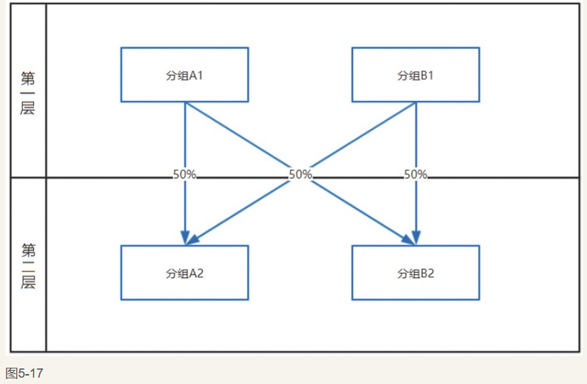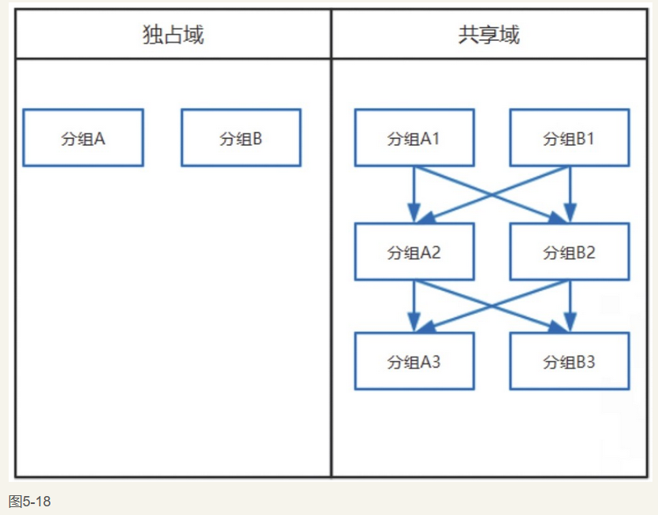

对用户进行合理的分组之后，接下来就正式进入AB测试的实施阶段了。

#### Q_4：如何充分证明AB测试分组的随机性？

​       在AB测试中，理论上，即使通过基于正交的方法可以保证用户分组的随机性，但是为了防止意外情况的发生，还需要引入“AA测试”的概念，进一步保证分组的随机性。通常分组情况如图5-19所示。

​       以上就是一个典型的试验分组策略。通常用A版本表示老版本，B版本表示新版本，按照6∶4的比例进行划分，同时从A版本中划分20%的用户进行AA测试。最终验证结果时，首先要保证AA测试通过，确保分组的合理性，然后看AB测试是否通过；如果AA测试没有通过，那么AB测试的结果就没有任何意义。

#### Q_5：简述AB测试背后的理论支撑。

​        这里需要考虑AB测试所运用的核心原理：根据中心极限定理，当数据量足够大时，可以认为样本均值近似服从正态分布。然后结合假设检验的内容，推翻或接受原假设。
​        关于中心极限定理的介绍，请参考3.1.3节。
​       最后要做的就是分析试验结果，这一部分要用到中心极限定理和假设检验。

#### Q_6：如何通过AB测试证明新版本用户的转化率高于老版本用户的转化率？

#### Q_7：当\bar x \ >\bar y \ 时，在什么条件下可以推翻原假设？

​       在图5-20中，橙色的竖线部分表示犯第一类错误的上限，用α表示，通常设定为5%或者1%。在原假设成立的前提下，

​       为了推翻原假设，需要使\bar x \ -\bar y \ 的值落在图5-20中的竖线部分，此时

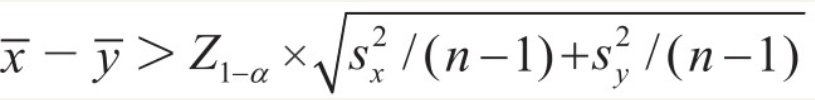

​       其中Z_{1}-α表示标准正态分布的1-α分位数。
​       以上是为了规避第一类错误而需要满足的条件。但是为了规避第一类错误，很可能会犯第二类错误，没有在原假设不成立的情况下接受备择假设。增加样本量是规避第二类错误最有效的方法。

#### Q_8：为了规避第二类错误，样本量要达到什么程度？

可以看到，随着样本量n的增加，上述公式中

​        的值也随之变小，犯第二类错误的概率也随着减少。在图5-20中，橙色的横线部分表示犯第二类错误的概率，用β表示，power=1-β，power即规避第二类错误的概率。通常在试验前会将power预设为80%，并且计算出为了达到该power值所需的样本量，称为最小样本量。

​        其中Φ（x）为标准正态分布的累积分布函数，Δ为AB测试前预估的差异值。通常使power值大于80%，可以计算出所需要的最小样本量。
​       AB测试的**优点**是：能够更加科学地解释项目效果，避免人为因素的干扰；

​       **缺点**是：为了保证AB测试能够达到预期的效果，需要有一定的**数据量**作为保证，否则会因为达不到AB测试的最低数据量要求而造成失败。另外，如果多个AB测试同时进行，则可能会因为相互干扰而无法达到预期的效果。
​       AB测试在互联网公司中被广泛运用，它涉及大量的统计学知识，在面试中通常是考查的重点，因此需要着重掌握。
本节内容总结如图5-21所示。

### 5.2.2 用户画像

​      用户画像是互联网公司大数据体系中非常重要的一个部分，通过用户画像，可以对用户进行全面分析——既可以利用用户画像“千人千面”地推荐相关产品，又可以基于用户画像分析产品目标用户，以及针对不同属性的用户采取不同的召回策略。
​     关于用户画像数据的计算、获取、存储有一套比较完善的系统，称为数据管理平台（DMP）。这部分内容只要了解即可，数据分析师关注更多的是用户画像数据的加工和应用。
​     在获取用户画像数据的过程中，与数据分析师工作密切相关的内容如图5-22所示。

#### Q_1：用户画像的数据源有哪些？

​      用户画像的数据源主要有两种，其中一种是用户基本属性数据，如性别、年龄、地域等；另一种是用户行为数据，如浏览、下单、观看等。

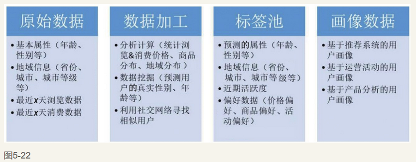

​       用户基本属性数据往往会存在缺失或者不准确，这部分数据大多来自用户注册时所填写的信息，并且不是强制性填写的，所以会存在一定的偏差。
​       用户行为数据则体现出用户近期的一些行为，对“近期”的定义要参照不同的产品属性，比如对于旅游类低频App来说，最近30天或者更久的数据都是需要关注的；而对于短视频这种产品，则通常需要关注30天甚至7天之内的数据。

#### Q_2 ：获取到用户画像数据后，如何加工呢？

​        一是通过分析计算，比如分析用户最近一段时间的消费金额、消费频次等，获得其活跃度以及相应的偏好，或者通过分析用户近期的登录地址或者订单地址等判断其所在地。
​      二是建立相应的数据挖掘模型，预测用户基本属性，如性别、年龄等，有效弥补基本属性数据的缺失以及偏差。比如在电商领域，可以根据用户近期浏览婴幼儿类产品的情况，再结合深度学习模型判断该用户（或其家人）所处的孕期，之后进行**更加准确**的商品推荐。

​        通过数据加工，可以获得一个完善的标签池，其中包含了大量的用户属性信息。比如对于用户小王，通过标签池，我们可以了解到小王的性别、年龄、居住城市以及该城市的等级（一线、二线、三线）等，同时也可以了解到小王近期的活跃度，并且会基于活跃度划分相应的等级，小王的一些偏好也能通过计算获得，如小王喜欢看的视频类型、关注的商品类型、对价格的敏感度、对不同类型活动的喜爱程度等。

​        很多人对用户画像的理解可能就限于此，认为用户画像**只是丰富标签池**的过程，所谓的基于用户画像分析也不过是将所有的标签数据进行对比，得到相关的结果，比如男性用户和女性用户的占比以及各自的转化率等。**实际上**，这只是对标签数据的应用，还不能算是用户画像层面的应用。只有根据需要将这些标签数据**进行有效的整合，重复使用这些数据，才能算是用户画像层面的应用。**:dog:

#### Q_3：如何利用标签池中的数据，根据用户画像进行相应的分析？

​       举例说明，假如现在有一个新产品需要推荐，目标用户是大城市的白领女性，这时就要通过标签池中的数据来刻画“大城市的白领女性”这一特征。首先预测性别，筛选出女性用户，居住在一线城市，然后排除对价格敏感度较高的用户，并且要求近期活跃度偏高。同时这部分用户通常对品质要求比较高，因此可以基于此选取出在商品偏好中品质占比较高的用户，这样就可以刻画出“大城市的白领女性”这一用户群体，并且将后续的活动消息优先发送给这部分用户。
​     用户画像在互联网公司中应用非常广泛，候选人需要对用户画像有深刻的理解。
本节内容总结如图5-23所示。

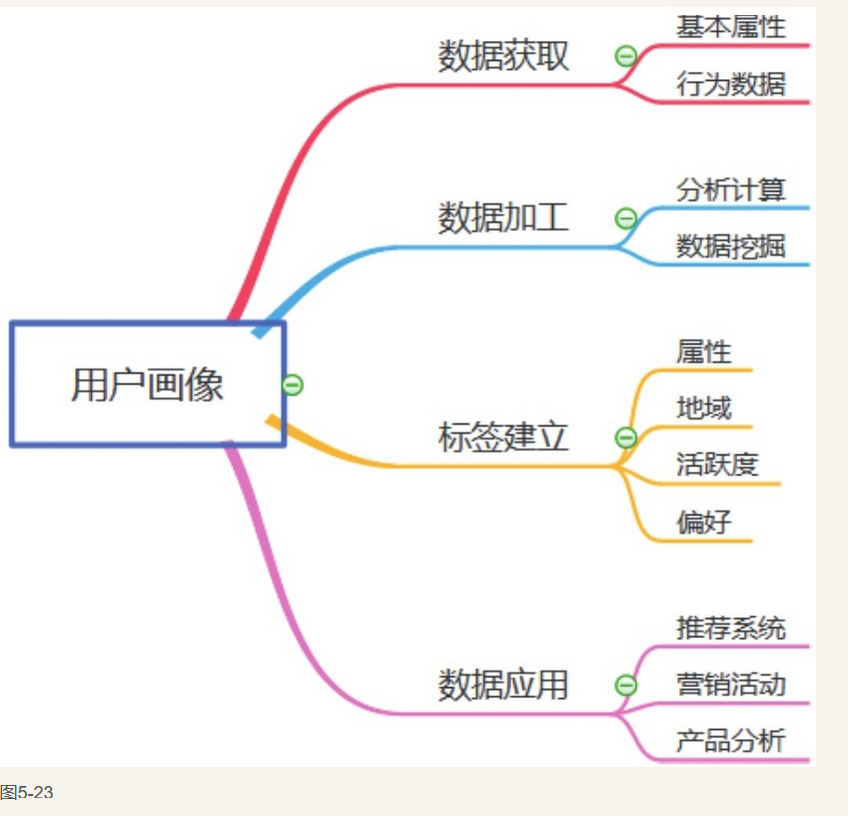

### 5.2.3 完整的数据挖掘项目流程

​       前面章节介绍了数据挖掘的一些基础知识，以及一些常见模型的优缺点、适用范围、评估方法等。这些内容更多的是理论层面的介绍，在实际工作中运用数据挖掘模型时要考虑的问题会更加全面。相比于课本上或者一些竞赛中的数据挖掘项目，在工作中运用的数据挖掘模型**要求更加敏捷且可操作性强**，也因此需要更加全面地评估模型并选取合适的模型。一个完整的数据挖掘项目流程分为如下**7步**。
​      1.分析问题，明确目标

​      这里以一个风险订单识别模型为例，实际上很多互联网公司都是中间商，需要连接用户与供应商，将用户的订单提供给供应商，由供应商履行订单。但是在这个过程中，很容易会因为各种原因使得订单无法顺利完成，这样的订单可以称为风险订单。
​       通过数据挖掘模型，可以提前预估订单风险的大小，采取有效措施规避风险，减少风险订单的数量。这样既可以减少经济损失，又可以提升用户体验。

​     2.模型可行性分析
​     并不是所有的问题都需要使用数据挖掘模型或者能够通过数据挖掘模型来解决。在建模之前需要进行可行性分析，没有进行可行性分析就盲目地套用模型，最终很可能会导致白白地费时费力。

#### Q_1：在建模之前，需要从哪些方面分析可行性？

​       上述风险订单识别问题最终可以被转化为二分类问题，将历史上的风险订单标记为1，将非风险订单标记为0，通过模型对所有订单的风险性进行打分，打分区间为0～1。通过模型训练得到阈值，对超过阈值的订单进行人工/自动干预，这样就将业务问题转化为了使用模型可以解决的问题。
​       当然，虽然可以用模型来解决问题，但是也要考虑两个重要因素，即KPI和历史数据量。

- KPI（关键绩效指标）：在建模前需要明确业务方为项目制定的KPI，并且计算为了实现KPI模型要达到的准确率、召回率等。如果通过计算得知模型所要达到的效果是难以实现的，那么显然需要调整KPI或者进行其他操作。

-  历史数据量：这是一个重要的判断模型是否可行的因素，再强大的模型，也需要通过训练足够的历史数据，从中进行学习，最终才能输出相应的结果。当历史数据量非常少时，需要考虑补充数据或者选取对数据量要求较低且复杂度较低的模型。判断模型可行性的流程如图5-24所示。

  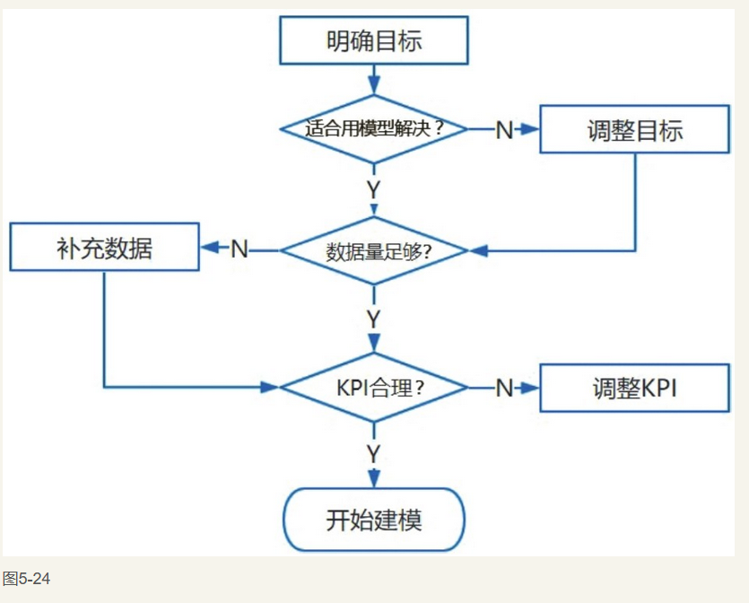

3.选取模型
       前面对一些常见的模型已经做了介绍，请参见3.2.2节。
4.选择变量
       在确定了模型之后，下一步要做的就是提取并选择**变量**。准备变量的过程也是非常重要的，通过讨论变量可以使大家对业务有更深的理解，常见的步骤包括：通过PRD文档、业务方需求文档，建立变量池；组织变量讨论会，拓宽对业务的认知，丰富变量池；借助SQL语句从数据库中提取变量，一小部分数据由业务方直接通过表格提供。

#### Q_2：常见的变量分类方法有哪些？

- T+1变量：前一天或更早的数据，主要是历史数据，对时效性要求不高。例如：用户、供应商标签画像数据，包括用户信用等级、供应商合作等级、规模大小等；用户、供应商历史风险订单及其他相关数据，如供应商被投诉情况等。

- 实时变量：短时间内获取的最新数据。通常延迟在5分钟之内，对实时性有较高要求。比如用户当天的行为数据，如App的打开、操作数据，在条件允许时可以使用GPS数据。还有供应商实时库存紧张程度，通常用0～1之间的值来刻画。

​      可以参考此前指标体系的拓展方法，对变量也进行相应的拓展，如以时间、用户等维度进行拓展，如图5-25所示。

5.特征工程
在选择好变量之后，对这些变量进行处理，称为特征工程。

#### Q_3：在数据挖掘项目中特征工程包括哪些方面？

（1）验证逻辑：这是特征工程中必要的步骤，特别是在添加某一变量使模型效果得到了极大提升之后。常见的逻辑错误如下：

- 因果关系倒置，将结果作为变量放入模型中，例如，通过用户评论情况判断订单是否被履行，实际上是后置数据，只有订单被履行的用户才会发表评论，相当于用结果证明过程。
- 忽略模型上线后变量计算时效性.
- 在取数过程中出现错误

（2）缺失值处理：对于一些模型（如XGBoost模型），在符合逻辑、确保缺失值具有一定意义的前提下，可以不做处理，其他情况都需要进行处理。在风险订单模型中，通常服务统计指标缺失的供应商为低频供应商，保留其空值，在一定程度上反而是最好的处理方法。

常见的缺失值处理方法如下：

- 用特定值表示（如-9999）。
- 统计插值（均值、中值、众数），适用于数值型变量。
- 模型插值：SKNN，参考最临近的k个值进行填补；EM聚类，选择不存在缺失值的变量进行聚类，根据所在类的其他值进行填补。

（3）异常值处理：判断业务逻辑在取数计算过程中是否出现错误，Hive取数时的join操作可能会因为一对多的对应关系而出现重复数据，需要随时验证数据的唯一性。

**统计方法**：3σ、盒形图、分位数。
**模型方法**：iForest（孤立森林），每次随机划分属性和划分点（值）时都是随机的，计算样本所处节点的深度，深度越小越可能为异常值。

常见的异常值处理方法如下：

- 删除异常数据所在的记录。
- 将异常值记为缺失值，用填补缺失值的方法进行处理。

6.建立模型&效果评估
       建立模型和效果评估这部分内容在前面的Python、R的章节中都有所介绍，这里不再赘述。
7.模型上线&迭代
      模型线下训练好之后，接下来需要做的就是正式上线。

#### Q_4：在模型上线前以及上线后，都需要做哪些工作？

​       在模型正式上线前，通常需要将模型封装成特定的模型文件交由开发部门，开发部门定时调用模型文件。当然，有些模型如线性回归模型上线时，就无须交付模型文件，只需提供变量对应的参数即可。目前比较常用的方法是将机器学习/数据挖掘模型打包成PMML文件。
​       PMML（Predictive Model Markup Language）是一种通用的基于XML的预测模型标记语言，由DMG组织发布，使用它能够做到：

- 任何语言都可以调用模型。
- 不存在调用的通信消耗。
-  直接部署上线，无须二次开发。
- 支持数据转换，比如标准化与one-hot编码等。

​       在模型上线前需要提前制定好监控策略，保证模型效果在可控范围内。
​       实际上，模型上线只是整个环节中的一环，并不代表项目结束，还要针对模型上线后的表现进行迭代及修正。随着模型的上线，此前很多有着非常重要作用的变量其重要性逐渐减弱，比如具备某一类属性的供应商因为模型的上线而被重点监控，该属性之后所起到的重要作用会有较大的减弱。
​      我们需要时刻保持对模型的迭代，并在相应的代码管理平台及时更新代码，做好模型版本编号，以此形成一个完整的闭环，如图5-26所示。

本节内容总结如图5-27所示。

