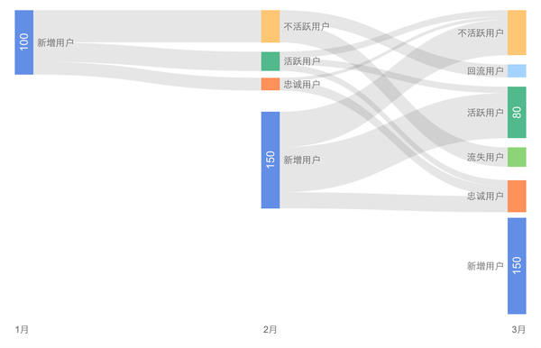
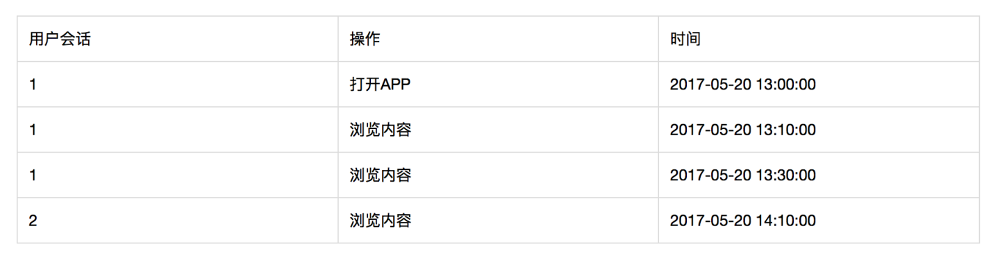
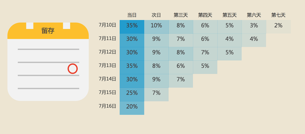
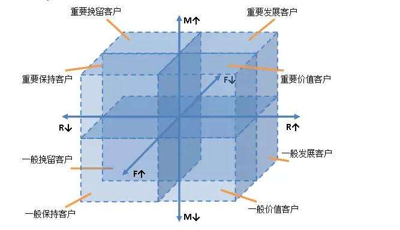
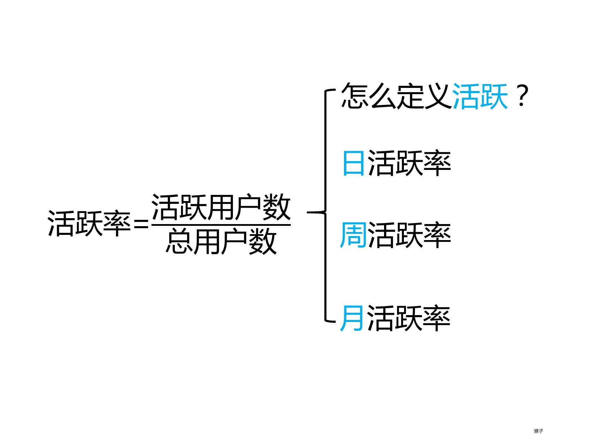
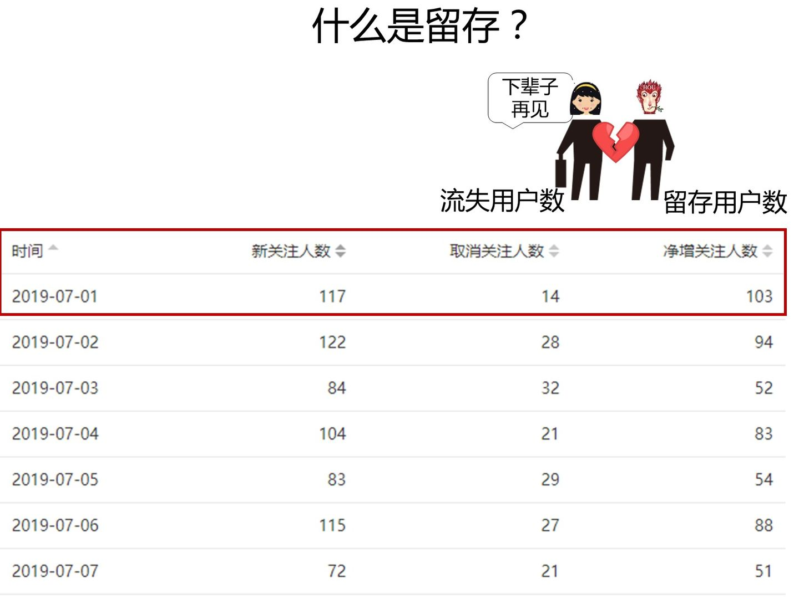

# 最全的运营数据指标解读

[秦路](https://www.zhihu.com/people/qin-lu-17)

数据分析话题下的优秀答主

[小匿](https://www.zhihu.com/people/shi-bu-shi-sha-97)等 

> 本文是[《如何七周成为数据分析师》](https://www.zhihu.com/question/29265587/answer/125091104)的第十七篇教程，如果想要了解写作初衷，可以先行阅读七周指南。温馨提示：如果您已经熟悉业务基础，大可不必再看这篇文章，或只挑选部分。

​		数据分析涉及不同的业务领域，很多时候，业务的了解比数据技巧更重要。很多新人常问Python、SQL，但鲜有问业务，可后者才决定分析的成败。

业务的洞悉决定了数据分析师发展的上限，数据技巧只是逼近它。好的分析师都懂业务，也必须懂业务。

我希望通过本文，让数据新人对业务有一个大概的了解，也适用产品和运营新人（我是互联网背景，所以本文更多涉及这块）。文章的内容会给你「宽」和「范」的感觉，希望对新人有帮助，老人一笑而过就行了。

## 用户获取

​		用户获取是运营的起始，用户获取接近线性思维，或者说是一个固定的流程：用户接触-用户认知-用户兴趣-用户行动／下载。每一个流程都涉及多个数据指标。

**渠道到达量**

俗称曝光量，即产品推广页中有多少用户浏览。它可以在应用商店，可以在朋友圈，可以在搜索引擎，只要有流量的地方，都会有渠道曝光。

​		曝光量是一个蛮虚荣的数字，想一想现代人，每天要接触多少信息？其中蕴含了多少推广，最后能有几个吸引到用户？更多时候，渠道到达量和营销推广费挂钩，却和效果相差甚远。

​		广告和营销还会考虑推广带来的品牌价值。用户虽没有点击或和产品交互，但是用户知道有这么一个东西，它会潜移默化地影响用户未来的决策。然而品牌价值很难量化，在广告计算中，系统只会将用户的行为归因到最近一次的广告曝光。

广告点击量称为CTR，广告点击量/广告浏览量，除了广告，它也应用在各类推荐系统的评价中。

**渠道转化率**

​		既然广告已经曝光，那么用户应该行动起来，转化率是应用最广阔的指标。业界将转化率和成本结合，衍生出CPM，CPC，CPS，CPD，CPT等。

​		CPM(Cost Per Mille)指每千人成本，它按多少人看到广告计费，传统媒介比较倾向采用。CPM推广效果取决于印象，用户可能浏览也可能忽略，所以它适合在各类门户或者大流量平台采用Banner形式展现品牌性。

​		CPC(Cost Per Click)指每用户点击成本，按点击计价，对广告主来说，这个比CPM的土豪作派理性多了。也有很多人会认为，CPC不公平，用户虽然没有点击，但是曝光带来了品牌隐形价值，这对广告位供应方是损失。

​		CPA(Cost Per Action)指每行动成本，按用户行为计价，行为能是下载也能是订单购买。CPA收益高于前两者，风险也大得多，它对需求方有利对供应方不利。

​		以上三种是常见的推广方式，CPT按时间，CPS和CPS算在CPA的范围内。渠道推广是依赖技术的行业，用户画像越精准，内容与用户越匹配，则越容易产生收益。

还有一种指标eCPM(effective cost per mille)，每一千次展示可获得收入，这是流量主预估自身收益的指标。

**渠道ROI**

ROI是一个广泛适用的指标，即投资回报比。

​		市场营销、运营活动，都是企业获利为出发点，通过利润/投资量化目标。利润的计算涉及财务，很多时候用更简单的收入作分子。当运营活动的ROI大于1，说明这个活动是成功的，能赚钱。

​		除了收入，ROI也能推广到其他指标，有些产品商业模式并不清晰，赚不到钱，那么收入会用其他量化指标代替。譬如注册用户量，这也就是获客成本了。

**日应用下载量**

​		App需要下载，这是一个中间态，如果不注意该环节也会流失不少用户。应用商店的产品介绍，推广文案都会影响。有些动辄几百M的产品，常将部分安装留在初次启动应用时以补丁形式完成，如各类游戏，就是怕漫长的下载时间造成玩家流失。

第三方平台下载到用户注册App，这步骤数据容易出错，主要是用户对不上。技术上通过唯一设备ID匹配。

**日新增用户数**

新增用户数是用户获取的核心指标。

新增用户可以进一步分为自然增长和推广增长，自然增长可以是用户邀请，用户搜索等带来的用户，而推广是运营人员强控制下增长的用户量。前者是一种细火慢炖的优化，后者是烹炸爆炒的营销。

**用户获客成本**

用户获取必然涉及成本，而这是运营新手最容易忽略的。曾经写过一篇文章描述获客成本，「[获取新增用户，运营都应该知道的事](https://link.zhihu.com/?target=http%3A//mp.weixin.qq.com/s%3F__biz%3DMjM5NjEyMDI2MQ%3D%3D%26mid%3D2455946696%26idx%3D1%26sn%3Da1f0b5e8eb97a412e98f7bd687c07cda%26chksm%3Db1787662860fff74bcda57aa4e76a11ba30fe1634da915a8301613a91e590cebcff345416502%26scene%3D21%23wechat_redirect)」。

**一次会话用户数**

一次会话用户，指新用户下载完App，仅打开过产品一次，且该次使用时长在2分钟以内。这类用户，很大可能是黑产或者机器人，连羊毛党都算不上。

这是产品推广的灰色地带，通过各种技术刷量，获取虚假的点击量谋取收益。该指标属于风控指标，用于监管。

## 用户活跃

​		用户活跃是运营的核心阶段，不论移动端、网页端或者微信端，都有相关指标。另外一方面，现在数据分析也越来越注重用户行为，这是精细化的趋势。

**日活跃用户/月活跃用户**

行业默认的活跃标准是用户用过产品，广义上，网页浏览内容算「用」，在公众号下单算「用」，不限于打开APP。「[一篇文章读懂活跃数据](https://link.zhihu.com/?target=http%3A//mp.weixin.qq.com/s%3F__biz%3DMjM5NjEyMDI2MQ%3D%3D%26mid%3D2455946685%26idx%3D1%26sn%3D2124858639f7b436c0e0f2b8503d0fd1%26scene%3D21%23wechat_redirect)」。

​		活跃指标是用户运营的基础，可以进一步计算活跃率：某一时间段内活跃用户在总用户量的占比。按时间维度，则有日活跃率DAU、周活跃率WAU和月活跃率MAU。活跃用户数，衡量的是产品的市场体量，活跃率，看的则是产品的健康。

​		可仅仅打开产品，能否作为产品健康的度量？答案是否定的。成熟的运营体系，会将活跃用户再细分出新用户、活跃用户、忠诚用户、不活跃用户、流失用户、回流用户等。流失用户是长期不活跃，忠诚用户是长期活跃，回流用户是曾经不活跃或流失，后来又再次打开产品的活跃用户。 

​	通过不同的活跃状态，将产品使用者划分出几个群体，不同群体构成了产品的总用户量。健康的产品，流失用户占比不应该过多，且新增用户量要大于流失用户量。

**PV和UV**

​		**PV**是互联网早期Web站点时代的指标，也可以理解为网页版活跃。PV(PageView)是页面浏览量，用户在网页的一次访问请求可以看作一个PV，用户看了十个网页，则PV为10。

​		UV(Unique Visitor)是一定时间内访问网页的人数，正式名称独立访客数。在同一天内，不管用户访问了多少网页，他都只算一个独立访客。怎么确认用户是不是同一个人呢？技术上通过网页缓存cookie或者IP判断。如果这两者改变了，则用户算作全新的访客。

​		PV和UV是很老的概念，但是数据分析绕不开他们，除了产品上各页面的浏览，在第三方平台如微信，各类营销活动都只能通过Web页实现，PV和UV便需要发光发热了。

​		有一点需要注意的是，微信浏览器不会长期保留cookie，手机端的IP也一直变动，基于此统计的UV会有误差(不是大问题,只是uv中的新访客误差较大)。这里可以通过微信提供的openid取代cookie作为uv基准，需要额外的技术支持。

**用户会话次数**

​		用户会话也叫session，是用户在时间窗口内的所有行为集合。用户打开App，搜索商品，浏览商品，下单并且支付，最后退出，整个流程算作一次会话。

​		会话的时间窗口没有硬性标准，网页端是约定俗成的30分钟内，在30分钟内用户不管做什么都属于一次会话。而超过30分钟，不如出去吃个饭回来再操作，或者重现打开，都属于第二次会话了。

移动端的时间窗口默认为5分钟。

​		用户会话次数和活跃用户数结合，能够判断用户的粘性。如果日活跃用户数为100，日会话次数为120，说明大部分用户都只访问了产品一次，产品并没有粘性。

用户会话依赖埋点采集，不记录用户的操作，是无法得知用户行为从哪里开始和结束的。另外一方面，用户会话是用户行为分析的基础。

**用户访问时长**

​		顾名思义，用户访问时长是一次会话持续的时间。不同产品类型的访问时长不等，社交肯定长于工具类产品，内容平台肯定长于金融理财，如果分析师发现做内容的产品大部分用户访问时长只有几十秒，那么最好分析一下原因。

**功能使用率**

​		除了关注活跃，运营和数据分析师也应该关注产品上的重要功能。如收藏，点赞，评论等，这些功能关系产品的发展以及用户使用深度，没有会喜欢一个每天打开产品却不再做什么的用户。

​		功能使用率也是一个很宽泛的范围，譬如用户浏览了一篇文章，那么浏览中有多少用户评论了，有多少用户点赞了，便能用点赞率和评论率这两个指标，然后看不同文章点赞率和评论率有没有差异，点赞率和评论率对内容运营有没有帮助，这些都属于功能使用率。又譬如视频网站，核心的功能使用率就是视频播放量和视频播放时长。

​		微信公众号指标即可以单独说，也能把它作为产品的功能延伸看待。图文送达率，转化分享率，二次转化分享率，关注者增量等和本文其他指标一脉相承。只是第三方数据多有不便，更多分析依赖假设。

## **用户留存**

如果说活跃数和活跃率是产品的市场大小和健康程度的话，那么用户留存就是产品能够可持续发展。

**留存率**

用户在某段时间使用产品，过了一段时间后，仍旧继续使用的用户，被称为留存用户。留存率 = 仍旧使用的用户/ 当初的总用户量。

​		在今天的互联网行业，留存是比新增和活跃提到次数更多的指标，因为移动的人口红利没有了，用户越来越难获取，竞争也越来越激烈，如何留住用户比获得用户更重要。

​		假设产品某天新增用户1000个，第二天仍旧活跃的用户有350个，那么称次日留存率有35%，如果第七天仍旧活跃的用户有100个，那么称七日留存率为10%。

​		Facebook有一个著名的40-20-10法则，即新用户次日留存率为40%，七日留存率为20%，三十日留存率为10%，有此表现的产品属于数据比较好的。

​		上面的案例都是围绕新用户展开，还有一种留存率是活跃用户留存率，或者老用户活跃率，即某时间活跃的用户在之后仍旧活跃的比率。它更多用周留存和月留存的维度。

​		新增留存率和活跃率是不同的，新增留存率关系于产品的新手引导，各类福利，而活跃留存率和产品氛围，运营策略，营销方式等有关，更看重产品和运营的水平。

**用户流失率**

用户流失率和留存率恰好相反。如果某产品新用户的次日留存为30%，那么反过来说明有70%的用户流失了。

​		流失率在一定程度能预测产品的发展，如果产品某阶段有用户10万，月流失率为20%，简单推测，5个月后产品将失去所有的用户。这个模型虽然简陋，用户回流和新增等都没有考虑，但是它确实反应了产品未来的生命周期不容乐观。

这里可以引出一个公式，生命周期 = （1/流失率）*流失率的时间维度。它是经验公式，不一定有效。

​		产品的流失率过高有问题么？未必，这取决于产品的背景形态，某产品主打婚礼管理工具，它的留存率肯定低，大多数用户结婚后就不用。但这类产品一定有生存下去的逻辑。旅游类的应用也是，用户一年也打开不了几次，但依旧能发展。

**退出率**

​		退出率是网页端的一个指标。网页端追求访问深度，用户在一次会话中浏览多少页面，当用户关闭网页时，可认为用户没有「留存」住。退出率公式：从该页退出的页面访问数/进入该页的页面访问数，某商品页进入PV1000，该页直接关闭的访问数有300，则退出率30%。

​		跳出率是退出率的特殊形式，有且仅浏览一个页面就退出的次数/访问次数，仅浏览一个页面意味着这是用户进入网站的第一个页面，俗称落地页LandingPage。

退出率用于网页结构优化，内容优化。跳出率常用于推广和运营活动的分析，两者容易混淆。

## 营销

​		营销也有自己的数据体系，互联网的数据体系就是脱胎于此才发展出AARRR框架。产品的发展模式有两种，如果一款产品能够在短时间获得百万用户，AARRR框架更适合它；如果一款产品从第一个用户起即有明确的商业模式，也能尝试套用市场营销的概念。

**用户生命周期**

用户生命周期来源于市场营销理论，旧称客户生命周期。有兴趣可以移步「[深入浅出，用户生命周期的运营](https://link.zhihu.com/?target=http%3A//mp.weixin.qq.com/s%3F__biz%3DMjM5NjEyMDI2MQ%3D%3D%26mid%3D2455946690%26idx%3D1%26sn%3D400d451331a2f51378629d960e16dc9f%26chksm%3Db1787668860fff7e4d914ba5c3d5c91d3ff682462cb19157efdde5d2cbfa3ae49e10a42a8109%26scene%3D21%23wechat_redirect)」。

​		它有两种含义,一种是针对用户个体/群体的营销生存窗口。用户会随时间推移发生变化，这种变化带来无数营销机会，对市场和企业是机遇。如怀胎十月,它就是一个生命周期为十月的营销窗口，企业会围绕这时期的用户建立特定营销。搬家，大学毕业，买房等都具有典型的周期特征。

​		另外一种是用户关系管理层面的生命周期，它对运营人员更重要。产品和用户的业务关系会随着时间推移改变。在传统营销中，分为潜在用户，兴趣用户，新客户，老/熟客户，流失客户。这几个层层递进的阶段和用户活跃很像。

​		对于一款母婴产品，我既要知道营销的生存窗口，即怀孕了几个月，因为孕早期和孕晚期的营销侧重点不一样，刚怀孕肯定是最合适的。也要知道用户本身和产品对应的关系，这位妈妈是新客户，还是曾经用过App但流失了。

​		营销数据分析中，最关键的环节就是新客户—流失客户这个阶段，一位用户能和产品互动多久，将决定产品的生命力。听起来和留存挺像的，上文提过的生命周期计算公式，就是脱胎于市场营销。

**用户生命周期价值**

​		生命周期价值是用户在生命周期内能为企业提供多少收益，它需要涉及财务定义。互联网行业更多提到生命周期，而不是生命周期价值，因为互联网的商业模式没有传统营销的买和卖那么简单明确。

​		举个例子，微信用户的生命周期价值能否计算？并不能，不论是广点通、游戏或者微信理财，都推导不出一个泛化的模型。但是部分产品，如金融和电商，生命周期价值是可计算的。

​		以互联网金融举例，某App提供理财和现金贷款两种业务，公司从这两个业务中获得收入通常是一个较稳固的比率，而成本支出平摊每个用户头上也是固定常数。所以利润就变成了用户理财和贷款的金额大小，以及生命周期的长短。这两者都是可估算的。

生命周期价值比生命周期重要，因为公司要活下去，就得赚更多的钱，而不是用户使用时间的长短。更多内容见「[运营的商业逻辑：CAC和CLV](https://link.zhihu.com/?target=http%3A//mp.weixin.qq.com/s%3F__biz%3DMjM5NjEyMDI2MQ%3D%3D%26mid%3D2455946707%26idx%3D1%26sn%3Dee998c624ee67a1a93cd3b1eb07d1b94%26chksm%3Db1787679860fff6f804527a79c099f74cb08f82b869a9240bb531c47e615d483e41719fab604%26scene%3D21%23wechat_redirect)」。

**客户/用户忠诚指数**

​		忠诚指数是对活跃留存的再量化。活跃仅是产品的使用与否，A用户和B用户都是天天打开App，但是B产生了消费，那么B比A更忠诚。数据往往需要更商业的指标描述用户，消费与否就是一个好维度。

我们可以用一个简化模型表示：

![[公式]](初步了解互联网指标.assets/equation)

t是一个时间窗口，s代表消费次数，代表的距今某段时间内的消费次数。若时间窗口选择月，那么t=1是距今第1个月内的消费次数，t=2是距今第2个月内的消费次数，列举数据如下。

将消费次数代入s/(s+1)，对数据进行转换，它的目的是收敛。以忠诚角度看，消费10次和消费100次的差异并不大，都属于很高且难以流失的用户，10/11和100/101的关系，并且有效规避极值。对于消费0次，1次，2次的用户，则对应0，0.5和0.66，在业务上也具备可解释性。

各月份求和得出的指数能反应用户在消费方面的忠诚。图例只是解释，实际应用过程中需要归一化，并且考虑时间权重：越近的消费肯定越忠诚。上述的模型在于简单，适合各类商业模式的早期分析，如金融投资，便可以计算用户每个季度的投资次数。

**客户/用户流失指数**

​		流失指数是对流失的再量化，它是忠诚指数的反面。流失率衡量的是全体用户，而为了区分不同用户的精细差异，需要流失指数。在早期，流失指数=1-忠诚指数。

​		流失指数和忠诚指数的具体定义能根据业务需要调整，比如忠诚按是否消费，流失按是否打开活跃，只要解释能站住脚。

在拥有足够的行为数据后，可以用回归预测流失的概率，输出[0,1]之间的数值，此时流失的概率便是流失指数。

**客户/用户价值指数**

​		用户价值指数是衡量历史到当前用户贡献的收益（生命周期价值是整个周期，包括未来），它是精细化运营的前提，不同价值的用户采取不同策略以最大化效果。

​		用户价值指数的主流计算方式有两种，一种是RMF模型，利用R最近一次消费时间，M总消费金额，F消费频次，将用户划分成多个群体。不同群体即代表了不同的价值指数。

第二种是主成分分析PCA，把多个指标转化为少数几个综合指标（即主成分），其中每个主成分都能够反映原始变量的大部分信息，且所含信息互不重复。

假设有一个旅游攻略网站，怎么界定优质的内容贡献者？用户的文章发布量？文章被点赞数？用户被关注数？文章好评数？文章更新频次？每个指标都挺重要的，主成分分析能囊括上述所有指标，将其加工成两到三个指标（通常是线性相关指标被合并）。这时再加工成价值指数则不难了。

上述各类指数，都是针对用户营销的明细数据。如何应用呢？最经典的是矩阵法，将指标划分出多个象限，如用户价值指数和用户流失指数。

对于用户价值高且流失指数高的用户，应该采取积极的唤回策略，对于用户价值低且流失指数高，那么考虑成本的平衡适当运营即可…这就是精细化运营的一个案例，也是市场营销多年来总结出的有效方法。

## **传播/活动**

把传播和活动放到一起讲，它们是一体两面。

**K因子** 

​		国外用得广泛的概念：每位用户平均向多少用户发出邀请，发出的邀请又有多少有效的转化率，即每一个用户能够带来几个新用户，当K因子大于一时，每位用户能至少能带来一个新用户，用户量会像滚雪球般变大，最终达成自传播。当K因子足够大时，就是快口相传的病毒营销。

国内的邀请传播，主体自然是微信朋友圈。微信分享功能和网页都是能增加参数统计的，不难量化。

**病毒传播周期**

​		活动、广告、营销等任何能称之为传播的形式都会有传播周期。病毒性营销强则强矣，除非有后续，它的波峰往往只持续两三天。这也是拉新的黄金周期。

​		另外一种传播周期是围绕产品的邀请机制，它指种子用户经过一定周期所能邀请的用户。因为大部分用户在邀请完后均会失去再邀请的动力，那么传播周期能大大简化成如下：假设1000位种子用户在10天邀请了1500位用户，那么传播周期为10天，K因子为1.5，这1500位用户在未来的10天内将再邀请2250位用户。

理论上，通过K因子和传播周期，能预测依赖传播带来的用户量，可实际的操作意义不大，它们更多用于各类活动和运营报告的解读分析。

**用户分享率**

​		现在产品都会内嵌分享功能，对内容型平台或者依赖传播的产品，分享率是较为重要的指标，它又可以细分为微信好友/群，微信朋友圈，微博等渠道。

​		有一点值得注意，数据只能知道用户转发与否，转发给谁是无法跟踪的。所以产品用物质激励用户分享要当心被薅羊毛。反正我转发都是给「文件传输助手」的…

**活动曝光量/浏览量**

​		传播和线上活动是息息相关的，这两者的差异不大。想要做好一个活动，单纯知道活动的浏览量是不够的，好的活动一定是数据分析出来的。以朋友圈最寻常见的红包营销举例。它的分析通过网页参数，如下：

[http://aaa.com/activity/bigsales/?source=weixin&content=h9j76g&inviter=00001&timestamp=1495286598](https://link.zhihu.com/?target=http%3A//aaa.com/activity/bigsales/%3Fsource%3Dweixin%26content%3Dh9j76g%26inviter%3D00001%26timestamp%3D1495286598)

​		问号后面的是网页参数，source=weixin说明网页是分享到微信的。content=h9j76g是页面具体内容，这里则是营销红包的类型。inviter=00001说明是哪个用户分享出去的，timestamp则是分享的具体时间戳。不同用户的分享页面有不同参数，按此作区分。

​		当这些页面被用户分享到朋友圈时，数据采集系统会记录所有页面的打开浏览。而页面参数则是活动精细化分析的前提。通过source=weixin，数据分析师知道了红包活动在微信的浏览量，相对应的还有QQ和微博。content则能看出用户喜欢哪个类型的红包，哪种红包被领取得多，成本又是多少。inviter则能看出平均每个分享者的分享页能带来多少浏览量。

​		参数越多，分析的维度就能越细，活动可优化的空间也越大。如果大家有心的话，可以看朋友圈(包括网页)各种活动的网页参数，观察其他产品的分析维度，它山之石可以攻玉，这是一个好习惯。

**活动参与率**

活动参与率衡量活动的整体情况，可以套用用户活跃的分析指标。

​		这个活动的参于人数(活跃数)多少？有多少老用户参与了这个活动？有多少新增用户因为这个活动来，传播类的活动分享数据怎么样？活动中的各个流程转化如何？活动带来多少新订单。其实，运营活动可以看作一个短生命周期的产品，产品的一切指标都能应用于其中。

​		好的活动应该机制化，把它融入到产品的功能机制中，比如滴滴打车的红包，美图饿了么的红包，都是从活动逐渐变成一种打法和抓手。更早期的各类网游，也是通过活动的推成出新成为了现在常态化的游戏功能。

活动的机制化，意味着数据要分析活动指标，发现优点以改进，之后同样常态化成报表：今天使用了多少红包，今天有多少用户因为活动新增，等等。

## 营收

​		产品，运营或者市场人员，从来不是为活跃、留存负责，而是商业，是企业的根本财务。数据分析也不是为了提高活跃和留存，而是像一个巨头的漏斗，最终将业务驱动于此，即回归商业的本质。

**活跃交易用户数**

从产品曝光到用户下载，用打开活跃到产生收入，产品的指标在一步步往商业靠拢，活跃交易用户则是核心指标。整个流程呈现漏斗状。

这里的交易，即是买方的消费，也包含卖方的供应。若平台包含B端和C端，则两端同等重要，均需要纳入数据体系。

和活跃用户一样，活跃交易用户也可以区分成首单用户(第一次消费)，忠诚消费用户，流失消费用户等。细分交易数据和指标，关系到产品商业化的进展，所以是有必要的。其实到这个环节，各类指标已经更倾向用户画像，而非报表统计了。

活跃用户交易比，统计交易用户在活跃用户中的占比。当产品活跃用户足够多，但是交易用户少，此时的商业化是有问题的，俗称的变现困难，很多公司都倒在这一步。

**GMV**

成交总金额，只要用户下单，生成订单号，便可以算在GMV里，不管用户是否真的购买了。互联网电商更偏好这个指标。

成交金额对应的是实际流水，是用户购买后的消费金额。销售收入则是成交金额减去退款。至于利润、净利率，涉及到财务成本，数据分析挺难拿到这类数据，所以不太用到。

把上述的三个指标看作用户支付的动态环节，则能再产生两个新指标，这也是数据分析的思维之一。成交金额与GMV的比率，实际能换算成订单支付率；销售收入和成交金额，也涉及到了退款率，当分析陷入卡顿时，不妨观察下这两个指标，或许有帮助。

**客单价**

传统行业，客单价是一位消费者每一次到场消费的平均金额。在互联网中，则是每一笔用户订单的收入，总收入/订单数。

很多游戏或直播平台，并不关注客单价，因为行业的特性它们更关注一位用户带来的直接价值。超市购物，用户购买是长周期性的，客单价可以用于调整超市的经营策略，而游戏这类行业，用户流失率极高，运营人员更关注用户平均付费，这便是ARPU指标，总收入/用户数。

ARPU可以再一步细分，当普通用户占比太多，往往还会采用每付费用户平均收入ARPPU，总收入/收费用户数。

**复购率**

若把复购率说成营收届的留存率，你就会知道它有多重要了。和新增用户一样，获得一个新付费用户的成本已经高于维护熟客的成本。

在不少分析场景中，会将首单用户单独拎出来作为一个标签，将两次消费以上的用户作为老客，之所以这样做，是从一到二的意义远不止加一那么简单。

用户第一次消费，可能是体验产品，可能是优惠，可能也是运营极大力地推动，各类因素促成了首单。而他们的第二次消费占比会有断崖式下跌(对应次日留存率的下跌)，因为这时候的消费逐渐取决于用户对产品的信任，模式的喜欢或者习惯开始养成。

很多时候，用户决策越长往往意味着客单价越高，如投资，旅游。此时首单复购率越是一个需要关注的指标，它意味着更多的利润。

复购率更多用在整体的重复购买次数统计：单位时间内，消费两次以上的用户数占购买总用户数。

回购率是另外一个指标，值得是上一个时间窗口内的交易用户，在下一个时间窗口内仍旧消费的比率。例如某电商4月的消费用户数1000，其中600位在5月继续消费，则回购率为60%。600位中有300位消费了两次以上，则复购率是50%。

**退货率**

退货率是一个风险指标，越低的退货率一定越好，它不仅直接反应财务水平的好坏，也关系用户体验和用户关系的维护。

## 商品

这里谈以商品为主的数据分析，商品不限于零售行业，知识市场、虚拟服务、增值服务都属于商品的一种。它有许多通用的分析模板，如购物车、进销存。

**购物篮分析**

购物篮分析不应限于电子商务分析，而是用户消费行为分析。

​		连带率是购物篮分析的一种指标，特指销售件数和交易次数之比。在大型商场和购物中心中，连带消费是经营的中心，用户多次消费即连带消费。在电商中是购物的深度，是单次消费提高利润的前提。

​		商品热度是一种快速见效的分析。可以将商品分为最热门Top20，最盈利Top20等，它依托二八法则，找出利润的抓手，很多营销会将它和连带率结合，像电子商务，重点推广多个能带来流量的热门爆款，爆款并不赚钱，而是靠爆款连带销售其他有利润的商品。这种流量商品连带利润商品的策略并不少见。

​		购物篮分析中最知名的想必是关联度，简单理解是，买了某类商品的用户更有可能买哪些其他东西。啤酒与尿布大概是最知名的案例了，虽然它是错的，但揭示了商品之间确实存在关联。

​		关联分析有两个核心指标，置信度和支持度。支持度表示某商品A和某商品B同时在购物篮中的比例，置信度表示买了商品A和人有多少同时买了B，表示为A→B。老王每次去菜场买菜都喜欢买一把葱，在老王的菜篮(购物篮)分析中，葱和其他菜的支持度很高，可是能说明老王买葱后就一定买其他菜(葱→其他菜)么？不能，只能说老王买了菜会去买葱(其他菜→葱)。除此还有提升度。 最有名的是Apriori算法。

​		关联分析并非只适用于购物篮，在很多营销场景中都会用它作为追加销售和交叉销售。常见有大额消费+现金贷，医疗健康+保险等，目的便是提高营收。

**进销存**

​		进销存是传统零售行业的经典管理模型，将企业商品经营拆分出采购、入库、销售三个环节，并且建立全链路的数据体系。在实际业务中，许多场景与进销存都息息相关。

​		电子商务有几个基础概念，商品、SKU、SPU。商品就是对应消费者理解的单品，任何主流的电子商务网站，商品详情页都对应一个商品，也称为SPU。而在商品详情页中，还会涉及尺码，颜色，样式的选择，这类属性形成了SKU，最小单位库存。每一个属性都对应着不同的SKU，如一件衣服有SML三个尺寸，则这件衣服是一个SPU，三个尺寸对应着三个SKU。

​		商品管理没有我们想象的那么简单，有些用户喜欢玫瑰金的iPhone，有些用户钟情于128G，如何更好地迈出这些商品，是从采购环节就开始的。

​		采购包括广度、宽度、深度三个维度。广度是商品品类，越充足的品类越能满足消费者的消费，但是也带来管理难销售难的缺点。市面上手机品类总共有50个，某手机店出售30种，品类比为60%。

​		采购宽度是SKU占比，代表商品供选择的丰富程度。iPhone有黑色、银色、玫瑰金三种颜色和16G、64G、128G三种容量，共9个SKU，如果手机店只卖玫瑰金色，则SKU占比0.33。采购深度是平均每个SKU的商品数量。

​		库存是一个中间状态，采购是进，销售是出。库存是一个动态滚动的变化过程，我们常拿过去时间窗口内的库存消耗速度衡量现有存量的消耗。某商场4月每天消耗库存1000件，4月末的库存为5万件，则这5万件的需要50天才能消耗完，50天被称为库存天数。虽然公式是理想状况，但以其判断缺货是没问题的。

​		销售环节大家更熟悉，指标聚焦在两个方面，销售的速度和销售的质量。销售速度常表示为售罄率，表示为时间窗口内的销售数量/时间窗口内的库存数量，这是比率，故可以用累计售罄率。某商品3月份累计售罄率50%，4月份累计售罄率60%，5月份累计售罄率80%，说明商品逐渐卖断货应该补货了，反过来售罄率一直低迷，则应该促销或者降低进货。

​		销售的质量和折扣率挂钩，乃是实收金额和标准金额的比率。国内各种红包折扣促销非常多，折扣率的统计师是非常有必要的。折扣率的典型应用是价格弹性指数：当价格变化1%时，商品销量变化的百分比。这个指数将直接影响利润。

​		进销存内容比较多，熟悉了留存活跃分析的人可能会稍有些不习惯。可是互联网变现的主流模式是电商或其变种，这方面的知识不可或缺。拿互联网金融来说，投资标的有典型的进货和库存特征，标的的投资额大小，风险等级与类型，标的剩余数量和预计库存天数，都是能直接适用进销存指标的。当分析师发现某理财标的库存天数过长，则要分析原因，是SKU过多，还是增长乏力。

## 最后

​		到这里，大家已经头晕了吧，业务是一个复杂体系，数据分析也从来不简单，两者结合都是充满挑战的。我的内容也没有囊括全部，比如电商还有搜索有效性的指标，用户在搜索框搜索，有多少为空搜索？而非空搜索中，有多少产生点击的有效搜索？小小一个搜索框也有很多门道。

​		更重要的能力是洞察和发现，文章所有的指标，并非我发明的，都是市场营销与数据分析的前辈总结而出，但是我个人学习中，并非囫囵吞枣，每个指标我都会停下思索如何用？过往哪种经验能和他联系起来。数据分析短期内是无法快速获得业务经验，但是多思考是一种更好掌握的技巧。

​		当然，分析中用不到那么多指标，往往两到三个关键指标足够，从业务方看，这些指标也不尽然是工作内容，大家别为KPI感到压力。更好的驱动与分析方式，是针对部门设立一个大目标，比如营收，将营收拆分成两到三个有逻辑关联的二级指标，如更多的付费用户能带来营收，更长的生命周期能带来营收，更高的客单价能带来营收。将二级指标分配个多个小团多或者按时间排期执行，二级指标也能拆分成三级。

# 最全的用户数据指标解读 (猴子)

**1.什么是指标？**

现代管理学之父 彼得·德鲁克 提出用管理促进企业增长，他讲过一句非常经典的话：如果你不能衡量，那么你就不能有效增长。

那么，如何去衡量呢？

就是用**某个统一标准**去衡量业务，这个统一标准就是指标。

**2.什么是用户数据？**

用户数据是指用户的基本情况，包括姓名、性别、邮箱、年龄、家庭住址、教育水平、职业等。

**3.常用的用户数据指标有哪些？**

如果把一款产品看作我的一个鱼塘，那么使用产品的用户就是鱼塘里的鱼。上次我聊到一款产品有3种用户：[新增用户，活跃用户，留存用户](https://link.zhihu.com/?target=http%3A//mp.weixin.qq.com/s%3F__biz%3DMzAxMTMwNTMxMQ%3D%3D%26mid%3D2649246846%26idx%3D1%26sn%3Da3051a5e31bf741efe29a68a7b95ad3f%26chksm%3D835fc44eb4284d58eea0118b1abeb9e436c94f926ad6fec6246b3ee4af3ef45206a37f4ed931%26scene%3D21%23wechat_redirect)。其中活跃用户对应的是不活跃用户，留存用户对应的是流失用户。

村里有很多人都有鱼塘，为了成为村里的首富，娶到村长的女儿，实现人生逆袭。我必须找到合适的指标来衡量鱼塘的鱼，从而制定对应的运营策略，才能靠养鱼赚到钱。

对于新增用户使用指标：日新增用户

对于活跃用户使用指标：活跃率

对于留存用户使用指标：留存率

下面我们分布来看下这3个用户数据指标。

**1）日新增用户**

日新增用户：就是产品每天新增用户是多少。

比如微信公众号的日新增用户是指每天新关注微信公众号的人数。下面图片里是我微信公众号（猴子聊人物）最近30天的日新增用户，将每天新增用户用折线连起来，就可以看出用户增长或者下跌的趋势。

**为什么要关注新增用户呢？**

一个产品如果没有用户增长，用户数就会慢慢减少，越来越惨淡，比如人人网。

同时，新增用户来自产品推广的渠道，如果按渠道维度来拆解新增用户，我们可以看出不同渠道分别新增了多少用户，从而判断出渠道推广的效果。

**2）活跃率**

怎么定义活跃呢？是指某个用户登陆了app算活跃用户？还是打开使用了app里哪个功能算活跃用户？

不同的产品定义不一样，所以看到这样的指标，一定要要搞清楚活跃是怎么定义的。

活跃用户数按时间又分为日活跃用户数(简称日活,DAU，Daily Active User)，周活跃用户数，月活跃用户数。

日活跃用户数(简称日活,DAU)：一天之内活跃的用户数。比如把打开微信公众号文章定义为活跃，日活跃用户数就是一天内打开微信公众号文章的人数。

周活跃用户数：一周之内至少活跃一次的用户总数。比如把打开微信公众号文章定义为活跃，周活跃用户数就是一周内打开微信公众号文章的人数。

月活跃用户数：一个月之内至少活跃一次的用户总数。比如把打开微信公众号文章定义为活跃，月活跃用户数就是一个月内打开微信公众号文章的人数。

上面图片中是三大电商2018年3月的累计月活跃人数。

需要注意的是，统计人数要去掉重复的数据，比如小明每天都在看我的微信公众号文章，每天活跃1次，一个月30天活跃30次。那么，月活跃人数是30吗？

当然不是，一个人一个月内活跃多次，也算1个人。所以活跃人数是1。

活跃率：是活跃用户在总用户数的占比，用活跃用户数除以总用户数。

根据时间可分为日活跃率、周活跃率、月活跃率等。

**3）留存率**

什么是留存？

通过渠道推广过来的新用户，经过一段时间可能会有一部分用户逐渐流失了，那么留下来的用户就称为留存，也就是有多少人留下来了。

所以留存和流失正好是相反的概念，好比一对分手的恋人，一个爱上了别人跑了，一个还爱着对方，留在原地。

我还是通过微信公众号来举例，把取消关注微信公众号的用户定义为流失，那么关注微信公众号的用户就是留存用户。上面图片里是我微信公众号后台的数据，7月1日有117人新关注了我的微信公众号，其中有14人又取消了关注，那么这新关注人里，剩下的103人就是这一天的留存用户数。

再比如在游戏app中，通过渠道推来的新用户，在一段时间内还会再再次登录游戏账号的就是留存用户。

**为什么要关注留存呢？**

可以评估产品功能对用户的黏性。如果一个产品留存低，那么说明用户对产品的黏性就小，就要想办法来提高留存了。留存反映了不同时期获得新用户的流失情况，如果留存低，就要找到用户流失的具体原因。

反映用户留存的指标，用留存率来表示。

留存率：（第1天新增的用户中，在第N天**使用过产品**的用户数）/第1天新增总用户数

这里需要注意的是“使用过产品”，不同的业务这块定义的不一样，要根据具体情况来确定，比如微信公众号使用过产品是指还关注该公众号。一款app，使用过产品是指打开过app。

根据时间，留存率又分为次日留存率，第7日留存率，第30日留存率等

> 次日留存率：（当天新增的用户中，在第2天使用过产品的用户数）/第一天新增总用户数
> 第3日留存率：（第一天新增用户中，在第3天使用过产品的用户数）/第一天新增总用户数
> 第7日留存率：（第一天新增的用户中，在第7天使用过产品的用户数）/第一天新增总用户数
> 第30日留存率：（第一天新增的用户中，在第30天使用过产品的用户数）/第一天新增总用户数

举个例子，某个app，我们把打开app定义为使用过产品。第一天新增用户100个，第二天这100个人里有40个人打开过app，那么次日留存率=40/100=40%。如果第七天这100个人人里有20个人打开过app，那么称七日留存率=40/100=20%

Facebook有一个著名的40-20-10法则，即新用户次日留存率为40%，7日留存率为20%，30日留存率为10%，有这个表现的产品属于数据比较好的。

**4.总结**

用户数据指标，记住这张鱼塘的案例图就可以了。用户数据指标有3个：日新增用户，活跃率，留存率。

