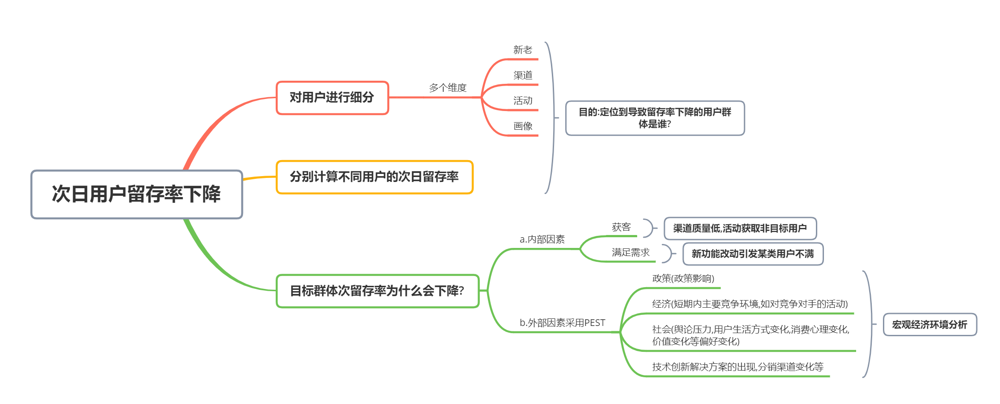
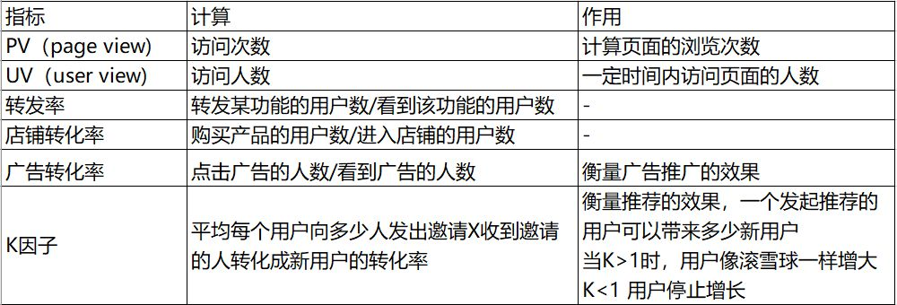
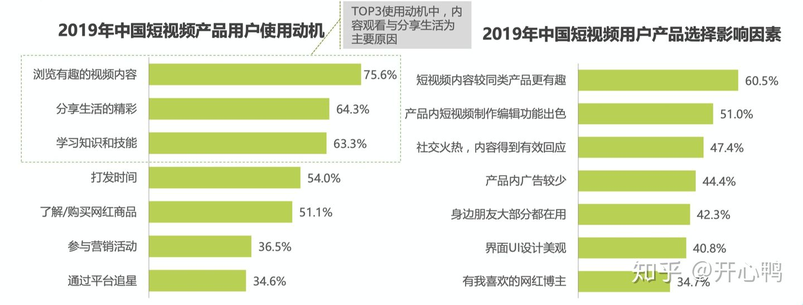
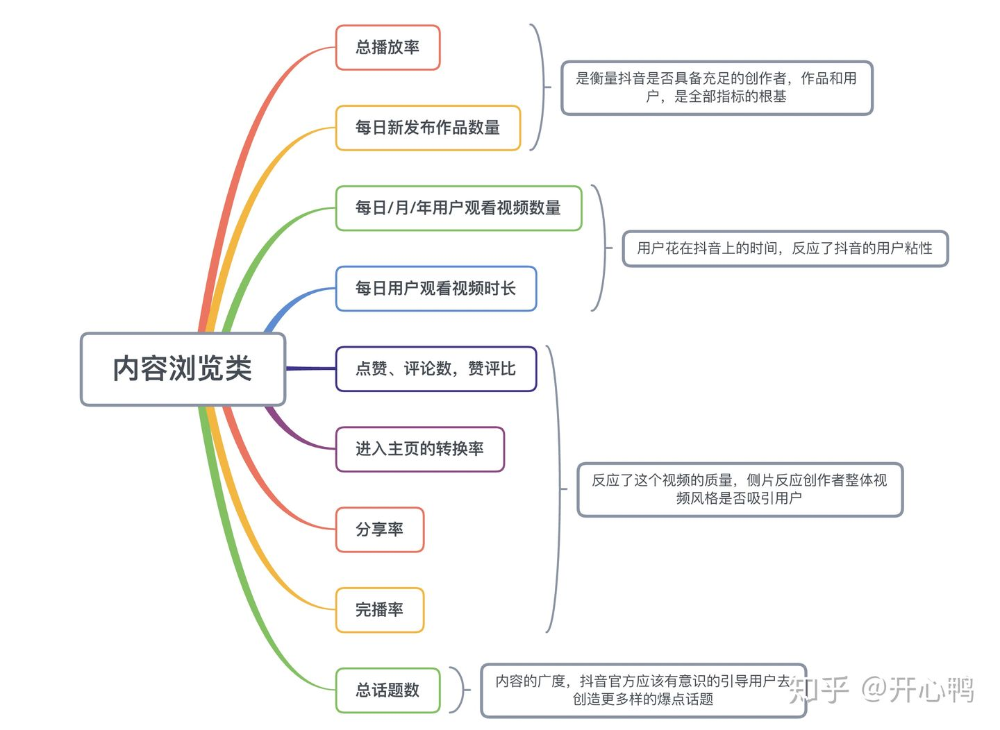
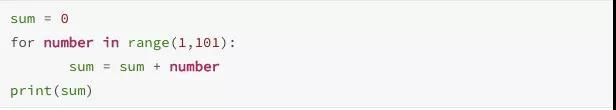
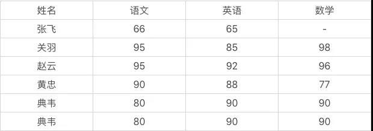

# 全网最全数据分析师面试干货-业务逻辑篇

首发于[胖熊酱的数据分析分享](https://www.zhihu.com/column/c_1023625957684342784)

# 全网最全数据分析师面试干货-业务逻辑篇

[胖熊酱](https://www.zhihu.com/people/xiong-man-man-76)

以下内容如有借鉴，均在文章末尾附上原文章链接。

1. **不用任何公开参考资料，估算今年新生儿出生数量？**

采用两层模型（人群画像x人群转化）：

新生儿出生数=Σ各年龄层育龄女性数量*各年龄层生育比率（两层模型，具有两个层面的模型。）。

从数字到数字：根据前几年新生儿出生数量数据，建立时间序列模型（需要考虑到二胎放开的突变事件）进行预测。

找关联指标，如婴儿类用品新增用户是新生儿出生的关联指标。

新生儿出生数=某宝平台的婴儿类用品的新增活跃用户数量*新生儿家庭转化率。

可以根据平台往年数据推算出新生儿家庭转换率，最后得出新生儿出生数。

2. **如果次日用户留存率下降了 5%该怎么分析？**

   

首先采用“两层模型”分析：对用户进行细分，包括新老、渠道、活动、画像等多个维度，

然后分别计算每个维度下不同用户的次日留存率。

通过这种方法定位到导致留存率下降的用户群体是谁。

对于目标群体次日留存下降问题，具体分析可以采用“内部-外部”因素考虑。

a. 内部因素分为获客（渠道质量低、活动获取非目标用户）、

满足需求（新功能改动引发某类用户不满）、

提活手段（签到等提活手段没达成目标、产品自然使用周期低导致上次获得的大量用户短期内不需要再使用等）；

b. 外部因素采用PEST分析（宏观经济环境分析），

政治（政策影响）、

经济（短期内主要是竞争环境，如对竞争对手的活动）、

社会（舆论压力、用户生活方式变化、消费心理变化、价值观变化等偏好变化）、

技术（创新解决方案的出现、分销渠道变化等）。

3. **卖玉米如何提高收益？价格提高多少才能获取最大收益？**

收益 = 单价*销售量，那么我们的策略是提高单位溢价或者提高销量。

- - 提高单位溢价的方法：
    品牌打造获得长期溢价，但缺陷是需要大量前期营销投入；
    加工商品占据价值链更多环节，如熟玉米、玉米汁、玉米蛋白粉（）；
  - 重定位商品，如礼品化等；
    价格歧视，根据价格敏感度对不同用户采用不同定价。

- 销售量=流量x转化率，上述提高单位溢价的方法可能对流量产生影响，也可能对转化率产生影响。

- 收益 = 单价x流量x转化率，短期内能规模化采用的应该是进行价格歧视，如不同时间、不同商圈的玉米价格不同，采取高定价，然后对价格敏感的用户提供优惠券等。

4. **类比到头条的收益，头条放多少广告可以获得最大收益？**

收益 = 出价x流量x点击率x有效转化率，放广告的数量会提高流量，但会降低匹配程度，因此降低点击率。

最大收益是找到这个乘积的最大值，是一个有约束条件的最优化问题。
同时参考价格歧视方案，可以对不同的用户投放不同数量的广告。

5.**APP激活量的来源渠道很多，怎样对来源渠道变化大的进行预警？**

- 如果渠道使用时间较长，认为渠道的app激活量满足一个分布，比较可能是正态分布。求平均值和标准差，对于今日数值与均值差大于3/2/1个标准差的渠道进行预警。
- 对于短期的新渠道，直接与均值进行对比。

6.**用户刚进来APP的时候会选择属性，怎样在保证有完整用户信息的同时让用户流失减少？**

- 采用技术接受模型（TAM）来分析，影响用户接受选择属性这件事的主要因素有：

技术接受模型提出了两个主要的决定因素：
1）感知的有用性(perceived usefulness)，反映一个人认为使用一个具体的系统对他工作业绩提高的程度；
2）感知的易用性(perceived ease of use)，反映一个人认为容易使用一个具体的系统的程度。
感知有用性：文案告知用户选择属性能给用户带来的好处
感知易用性：
a. 关联用户第三方账号（如微博），可以冷启动阶段匹配用户更有可能选择的属性，推荐用户选择。
b. 交互性做好。
3）使用者态度：用户对填写信息的态度
a. 这里需要允许用户跳过，后续再提醒用户填写
b. 告知用户填写的信息会受到很好的保护
4）行为意图：用户使用APP的目的性，难以控制
5）外部变量：如操作时间、操作环境等，这里难以控制

**7.如何识别作弊用户（爬虫程序， 或者渠道伪造的假用户）**

- 分类问题可以用机器学习的方法去解决，下面是我目前想到的特征：
  （1）渠道特征：渠道、渠道次日留存率、渠道流量以及各种比率特征
  （2）环境特征：设备（一般伪造假用户的工作坊以低端机为主）、系统（刷量工作坊一般系统更新较慢）、wifi使用情况、使用时间、来源地区、ip是否进过黑名单
  （3）用户行为特征：访问时长、访问页面、使用间隔、次日留存、活跃时间、页面跳转行为（假用户的行为要么过于一致，要么过于随机）、页面使用行为（正常用户对图片的点击也是有分布的，假用户的行为容易过于随机）
  （4）异常特征：设备号异常（频繁重置idfa）、ip异常（异地访问）、行为异常（突然大量点击广告、点赞）、数据包不完整等

**8.怎么做恶意刷单检测?**

分类问题用机器学习方法建模解决，我想到的特征有：
1）商家特征：商家历史销量、信用、产品类别、发货快递公司等
2）用户行为特征：用户信用、下单量、转化率、下单路径、浏览店铺行为、支付账号
3）环境特征（主要是避免机器刷单）：地区、ip、手机型号等
4）异常检测：ip地址经常变动、经常清空cookie信息、账号近期交易成功率上升等
5）评论文本检测：刷单的评论文本可能套路较为一致，计算与已标注评论文本的相似度作为特征
6）图片相似度检测：同理，刷单可能重复利用图片进行评论

**9.一个网站销售额变低，你从哪几个方面去考量？**

- 首先要定位到现象真正发生的位置，到底是谁的销售额变低了？这里划分的维度有：
  a. 用户（画像、来源地区、新老、渠道等）
  b. 产品或栏目
  c. 访问时段
- 定位到发生未知后，进行问题拆解，关注目标群体中哪个指标下降导致网站销售额下降：
  a. 销售额=入站流量x下单率x客单价
  b. 入站流量 = Σ各来源流量x转化率
  c. 下单率 = 页面访问量x转化率
  d. 客单价 = 商品数量x商品价格
- 确定问题源头后，对问题原因进行分析，如采用内外部框架：
  a. 内部：网站改版、产品更新、广告投放
  b. 外部：用户偏好变化、媒体新闻、经济坏境、竞品行为等.

**10.用户流失的分析，新用户流失和老用户流失有什么不同？**
1）用户流失分析：

- 两层模型：细分用户、产品、渠道，看到底是哪里用户流失了。注意由于是用户流失问题，所以这里细分用户时可以细分用户处在生命周期的哪个阶段。（用户生命周期：引入，成长，成熟，休眠，流失。）
- 指标拆解：用户流失数量 = 该群体用户数量*流失率。拆解，看是因为到了这个阶段的用户数量多了（比如说大部分用户到了衰退期），还是这个用户群体的流失率比较高
- 内外部分析：
  a. 内部：新手上手难度大、收费不合理、产品服务出现重大问题、活动质量低、缺少留存手段、用户参与度低等
  b. 外部：市场、竞争对手、社会环境、节假日等

2）新用户流失和老用户流失有什么不同：

新用户流失：原因可能有非目标用户（刚性流失）、产品不满足需求（自然流失）、产品难以上手（受挫流失）和竞争产品影响（市场流失）。
新用户要考虑如何在较少的数据支撑下做流失用户识别，提前防止用户流失，并如何对有效的新用户进行挽回。

老用户流失：原因可能有到达用户生命周期衰退期（自然流失）、过度拉升arpu导致低端用户驱逐（刚性流失）、社交蒸发难以满足前期用户需求（受挫流失）和竞争产品影响（市场流失）。
老用户有较多的数据，更容易进行流失用户识别，做好防止用户流失更重要。当用户流失后，要考虑用户生命周期剩余价值，是否需要进行挽回。

**11.GMV升了20%怎么分析？**

应该先估算一下数字有没有问题。

同样的套路：
1）两层模型：进行用户群体、产品、渠道细分，发现到底是谁的GMV提升了
2）指标拆解：将GMV拆解成乘法模型，如GMV=广告投放数量广告点击率产品浏览量放入购物车率交易成功率*客单价，检查哪一步有显著变化导致了GMV上升
3）内外部分析：
a. 内部：网站、产品、广告投放、活动等
b. 外部：套PEST等框架也行，或者直接分析也行，注意MEMC即可

这一题要注意，GMV流水包括取消的订单金额和退货/拒收的订单金额，还有一种原因是商家刷单然后退货，虽然GMV上去了，但是实际成交量并没有那么多。

**12.如果现在有个情景，我们有一款游戏收入下降了，你怎么分析？**

- 两层模型：细分用户、渠道、产品，看到底是哪里的收入下降了
- 指标拆解：收入 = 玩家数量 * 活跃占比 * 付费转化率 * 付费次数 * 客单价
  进一步细分，如玩家数量 = 老玩家数量 * 活跃度 + 新玩家数量 * 留存率等。然后对各个指标与以往的数据进行对比，发现哪些环节导致收入下降
- 原因分析：
  a. 内部：产品变化、促活活动、拉新活动、定价策略、运营策略、服务器故障等
  b. 外部：用户偏好变化、市场环境变化、舆论环境变化、竞争对手行为、外部渠道变化等
- 如何提高：基于乘法模型，可以采用上限分析，从前往后依次将指标提升到投入足够精力（假设优先分配人力、经费与渠道）后的上限，然后分析“收入”指标的数值提升。找到数值提升最快的那个阶段，就是我们提高收入的关键任务。

**13.现在有一个游戏测试的环节，游戏测试结束后需要根据数据提交一份PPT，这个PPT你会如何安排？包括什么内容？**
这里可以套AARRR模型：
获取用户（Acquisition）
提高活跃度（Activation）
提高留存率（Retention）
获取收入（Revenue）
自传播（Refer）

- 获取：我们的用户是谁？用户规模多大？
  a. 用户分层

- 激活：游戏是否吸引玩家？哪个渠道获取的用户有质量（如次日留存高、首日停留时间长等）？

- 留存：用户能否持续留存？哪些用户可以留存？

- 转化：用户的游戏行为如何？能否进行转化？能否持续转化？

- 自传播：用户是否会向他人推荐该游戏？哪种方式能有效鼓励用户推荐该游戏？传播k因子是否大于1？

  

**14.比如你对楼市不熟悉，现在要你去做一个像58同城之类的，卖房的中介，电商，你会如何进行分析。** 

1）商业模式分析：中介做的是双边市场生意，通过解决市场信息不对称下的信息流动问题，降低买方和卖方的交易成本，从而创造盈利空间
2）需求分析：
a. 买方需求分析：低价买好房，对时间的需求有快的和慢的
b. 卖方需求分析：房子卖高价，对时间的需求有快的和慢的
3）进入条件分析（套SWOT分析法（态势分析法）也行）：
a. 自身条件
b. 竞争对手
c. 市场增长规模
4）进入策略分析：
a. 自身目标
b. 目标拆解
c. 分析目标达成的可能性，预估将来一段时间，好/正常/坏条件下的目标达成情况
d. 得出结论：是否进入该市场

15. **某业务部门在上周结束了为期一周的大促，作为业务对口分析师，需要你对活动进行一次评估，你会从哪几方面进行分析?**

    1） 确定大促的目的：拉新？促活？清库存？
    2） 根据目的确定核心指标。
    3） 效果评估：
    a. 自身比较：活动前与活动中比较
    b. 与预定目标比
    c. 与同期其它活动比
    d. 与往期同类活动比
    4）持续监控：
    a. 检查活动后情况，避免透支消费情况发生
    b. 如果是拉新等活动，根据后续数据检验这批新客的质量

**16.作为一个数据分析师如何分析一次便利店推广活动的效果？需要分析哪些指标？**

**17.你觉得使用 Excel 和 R /python进行数据可视化的差别是什么？**

**18.对于化妆品行业你会从哪些指标进行数据分析？**

**19.在笔试/面试中回答[数据分析](https://link.zhihu.com/?target=http%3A//cda.pinggu.org/)场景相关的问题？分三步走：**

第一步：明确你遇到的场景类型

企业数据分析场景可分为以下几种：

经营数据分析：指收入、销量等企业经营活动相关的数据分析；

销售数据分析：指销售收入、销售额、销售单产等与销售活动直接相关的[数据分析](https://link.zhihu.com/?target=http%3A//cda.pinggu.org/view/21419.html)：与经营分析的区别是销售分析粒度更细，频次更密要求速度更快；

客户数据分析：即CRM分析，指客户购买额、购买频次、购买偏好等客户产生的相关数据的分析；

营销/市场数据分析：指企业营销/市场活动的投放、反馈、效果相关数据的分析，运营分析可归入这一类，也可归入产品类；

产品数据分析：单个产品的数据分析，包括实物产品和服务产品（互联网产品也归入服务产品类）；

确定场景后，进入第二步：明确分析目标

对于不同的场景，分析目标是不一致的：

经营数据分析：监控企业的运行情况，目标是发现企业经营活动中的问题，主要关注点是销量/销售额总体时序变化、地区分布、总体

单个点变化原因；

销售数据分析：目标是保证完成销售任务，监测销售效率低的原因，提出解决办法，主要关注时序进度、落后原因、销售单产情况等；

客户数据分析：目标是深入理解客户，典型方法是RFM模型；

营销/市场数据分析：目标是了解投放效果，优化投放计划，提升投放效率，关注点主要集中在ROI相关的指标；

产品数据分析：综合了前边几类分析的内容，分析目标则集中在某个产品上；

目标明确以后，最后一步：搭建分析体系

**每一个场景里的内容看似复杂，但记住两个核心，即可推导出所有的分析点：**

核心一：绝大多数分析都是针对人（内部人员和客户）、财（收入，支出）、物（产品，服务）三个对象进行的，所有的基础分析指标

由单个对象或对象间的组合推导出来。

核心二：做分析时处理指标记住八个字：变化、分布、对比、预测

变化：指标随时间的变动，表现为增幅（同比、环比等）；

分布：指标在不同层次上的表现，包括地域分布（省、市、区县、店/网点）、用户群分布（年龄、性别、职业等）、产品分布（如动感地带和全球通）等；

对比：包括内部对比和外部对比，内部对比包括团队对比（团队A与B的单产对比、销量对比等）、产品线对比（动感地带和全球通的ARPU、用户数、收入对比）；外部对比主要是与市场环境和竞争者对比；这一部分和分布有重叠的地方，但分布更多用于找出好或坏的地方，而对比更偏重于找到好或坏的原因；[数据分析培训](https://link.zhihu.com/?target=http%3A//cda.pinggu.org/)

预测：根据现有情况，估计下个[分析](https://link.zhihu.com/?target=http%3A//cda.pinggu.org/view/21410.html)时段的指标值。

将两个核心的内容叠加到一起，分析体系基本就建立了。

**20.京东商城销量增长了20%,怎么进行分析**

**21.设计一个未来汽车，你会设计一些什么功能**

**22.100的阶乘有多少个0**

100的阶乘有24个结尾0。具体算bai法如下：

一、du首先确定5因子有多少：

在100内，因子是zhi5的数有5, 10, 15, 20, 25... 总共有20个。但是25, 50, 75, 100都包含了2个5作为dao因子（25=5*5, 50=2*5*5），对于这些数，需要多数一次。所以总共有24个5因子。从公式角度： 5因子的数目 = 100/5 + 100/(5^2) + 100/(5^3) + ... = 24 （必须是整数）

二、确定2的因子有多少：

2, 4, 6, 8, 10, ... 总共有100/2=50个2因子，100/4=25个4因子（要多计数一次），100/8=12个8因子（要多计数一次）所以2因子的数目 = 100/2 + 100/(2^2) + 100/(2^3) + 100/(2^4) + 100/(2^5) + 100/(2^6) + 100/(2^7) + ... = 97综上所述，共有24个5因子 和 97个2因子，所以能凑24 个 (2,5) 对。综上所述100的阶乘也就有24个结尾零。

**23.问了一个怎么计算通勤天数的题目（根据共享单车在各个时间点返回的对应经纬度）**

**24.为商家设计电子菜单，个性化推荐菜单可以用一些什么特征**

**25.单纯按照销量来推荐热门菜会出现什么问题**

**26.利用美团点评平台的所有数据，为一个准备开店的人做出策略**

**27.一个果农种西瓜有100亩地。有一个卖肥料地推销他的肥料，说可以提高30%产量。**

果农第一年在10亩地中试验，的确可以达到30%的提升。第二年全量使用，结果只有5%的提升，这是什么原因导致的？想出一个方法评估这一个肥料真实提高。

**28.果农拉西瓜出去卖。拉100斤西瓜，然后每斤成本5元，卖10元一斤，卖完了所有的西瓜，赚了500元。请问果农怎么提高收入？（每天都只有100斤西瓜的供应量）**

**29.提高单价，会导致销量降低。假设，销量与单价之间满足销量y=a*单价x+b的函数。果农最大收益是多少？果农要用什么策略来提高价格？**

**30.抖音要现在有两个新功能，直播跟私信。你怎么利用这两个功能的现状来评估，应该重点推广哪一个功能（面试官有提示，这两个功能类型不同之类的）你推广了这个功能之后，怎么评估推广的效果**

**31.对这两个功能做abtest(可能我自己挖坑说了abtest)，怎么控制实验组，对照组的人数（目前假设抖音日活1.5亿人）**

**32.17年，12月抖音，IOS用户的平均停留时长翻倍。已经发现：1.机型越新的用户，涨幅越大；2.安卓用户没有发生这个情况；3.这期间没有运营活动。分析这一现象的原因。**

**33.订单量下降什么因素影响？** 

A：基于对业务的理解。

内部原因：经营问题，设计问题；

外部原因：天气原因，整个大环境影响，其他竞争对手采取行动等

**34.根据已有数据如何判断用户的一些未来行为？**

 A：基于对业务数据的理解，脑洞要大。

**35.京东商城要打5-6线渠道，PPT上放什么怎么放？对接人是CXO**

**36.怎么向小孩子解释正态分布（考虑到小孩子的智力水平）？**

37.有一份分析报告，周一已定好框架，周五给老板，因为种种原因没能按时完成，怎么办？

38. **业务的定义和分类？**

什么是业务，借用某个大V的定义，就是把产品，以合理的方式，通过渠道，卖给用户，赚取利润。所以业务基本就分为这几类：产品、运营、渠道、用户、利润。

39. **产品**

1）设计前

需要一些宏观数据

2）设计中

确定需要收集哪些用户信息，我们能收集哪些，做一个埋点上的设计。

3）设计后

主要是产品迭代，更多是关注用户的使用情况。没有一个产品刚出来就是完美无缺的。产品迭代需要三个方面的数据支持：用户量、客群结构、功能点使用情况。

4）怎么进一步了解产品

第一， 亲自使用产品、卖点、用户、各个功能特别熟悉——意向行业、公司

第二， 产品配套的营销、运营推广——经典文章、资深人士的意见——搜一下意向的公司

第三， 产品优化通用的指标——数据如何指导产品优化——网上有很多文章

40. **运营**

1）定义

能够接触到用户的地方就会接触到运营

2）种类

内容、提升业绩、服务类

3）内容运营

各种push啊、公众号、微博、品牌方。主要目的是：通知用户某些事情、唤醒用户、与用户互动、做活动

4）提升业绩运营

目的：促进消费

有哪些方式：促销活动、新品试用、节日纪念日活动（京东618、淘宝双11）

**41.服务类运营**

针对用户的主动行为去做出反应。

42. **运营的关注点**

接触用户的渠道有哪些？哪种渠道最好？

关注时机：热点

运营方式和运营目的：

传递信息：关注文案、包装、希望用户如何回应

提升业绩：方式、后续效果怎样

服务：哪种方式最受用户喜爱、能解决问题

**43.运营的考核指标**

内容类：到达率、相应度

业绩：短期、长期、成本控制、ROI

服务用户：用户量、使用率、满意度

**54.怎么进一步了解运营**

1）归纳每一类的运营方式：常用的内容运营方式、常用的拉动业绩方式、会员管理方式、等等

2)归纳每类情况业务部门会关注什么指标，为什么？

45. **渠道**

1)定义

就是把产品暴露在用户面前

2)作用

拉新和销售。

线上：拉新和接触客户、产品推销、交易、跟进。主要途径：网络广告、应用商店、短信、电话。

线下：门店、传统企业包括加盟、代理——销售、拉新（地推）

搜索推广效果转化漏斗

3)关注点

关注业绩相关指标，包括客单价、成交量、订单付、新增客户、渠道成本（获客成本、获客质量）等等

4)怎么进一步了解渠道

了解常见的关于业绩/拉新的相关指标

大致了解常见的销售方式、销售流程、特点

观察我们遇到的销售是怎么做的

46.、 用户

1)用户的作用

存在就是一种价值。互动、活跃、存在过

带来消费。分为直接消费和促进消费

转介绍、带来流量。分享有奖、微信转发到朋友圈免费领取课程、个人影响力 大V、主播

2) 常见的用户分层角度

做用户分析，最根本也是最重要的就是用户数据。

用户画像：根据用户的静态信息、行为等等对用户进行分类、分层。

切入点非常重要

3) 用户价值 RFM

最近一次消费(Recency)

消费频率(Frequency)

消费金额(Monetary)

参考这个链接[http://wiki.mbalib.com/wiki/RFM%E6%A8%A1%E5%9E%8B](https://link.zhihu.com/?target=http%3A//wiki.mbalib.com/wiki/RFM%E6%A8%A1%E5%9E%8B)

写的非常清楚，里面还有实例分析。

**47.用户生命周期 AARRR**

1) 获取用户 Acquisition

如何低成本的获客、怎么打动用户、抓住用户的吸引力

2) 激活 Activation

如何避免注册多、打开少，让用户称为产品真正的使用者

用户的激活路径是怎样的？用户在哪一步流失？怎么提升转化率？

配合一些策略：补贴、发push唤醒用户

3) 留存 Retention

让用户养成使用产品的习惯，对于用户的生命周期有不同的策略

4) 变现 Revenue

根据商业模式的不同，创造收益的方式也不同。

今日头条：通过创造广告位、雇佣写手创造更多内容

电商：直接购买

需要重视的是，夹点。指的是用户损失潜在收益的地方，比如电商购买付费的路径，分析用户在哪一步停止付钱。

5) 推荐 Reference

48. **用户活跃度**

月活、周活、日活、沉默、高活、低活

**49 业务相关维度**

婚恋网站和支付宝

50. **如何进一步了解用户**

了解行业内常见的用户数据，具体就是指，行业内到底能够收集到哪些数据。

不同维度的用户分层

不同维度的用户标签

知乎上很多这种文章，运营会画很多思维导图

51. **盈利**

利润=收入-成本

成本包括：产品、推广、人力、渠道、运转、新客，收入则取决于企业的盈利模式。

盈利模式包括以下几种：

To B

To C

To B & To C

52. **企业的组织架构**

互联网的企业组织架构基本包括：

管理层、产品、技术、运营、市场

产品包括设计、落地、优化，类似于项目经理的岗位。

技术包括前端、后端

运营分为产品、内容、活动三个方面

市场包括品牌推广、销售

# **面试业务知识技巧**

**举例1 重大波动问题**

面试官：哎呀，我们最近业绩很不好，怎么办？

第一步，询问相关背景：具体指哪些指标、原来多少、现在多少？具体下降了多少？一步步咨询

面试官：我们那个销售额下降了90%。

结合行业背景来看，问题是不是真的很严重。有些行业下降90%也是很正常的，比如节假日、旅游

询问得到，不是行业背景问题，业绩确实下滑这么多，而且问题很严重

核查数据是否准确，数据是否错误、遗漏，因为重大问题是小概率事件，很多情况下是数据出了问题

数据没有错误，最近是否有重大事件出现

迅速做出反应，能用的方法都用上，因为事已至此，只能尽力挽救。

**举例2 普通的上升下降问题（用户量、活跃度、新增、销量减小）**

面试官：我们最近用户量突然下降了

用户指注册用户吗？具体是哪些指标，原来多少、现在多少

面试官：日活注册量下降10%

是否行业规律

不是行业规律，继续拆分问题

时间维度：什么时候下降

新用户/老用户问题

新用户：哪些渠道

老用户：长期用户、短期用户、没有需求还是哪里体验不好

衡量改善成本和效果

定位到地推的新增用户少了

54.假设Y公司预计一年内要采购1万台服务器，目前有两种采购策略：1.在一季度一次性完成采购；2.划分为4个季度逐步完成全年采购。试分析两种采购的优缺点，以及你选择哪一种采购方案，说明决策理由。

我给你举几个例子吧

1)考虑财报因素

一次性采购会产生大量固定成本和应付（若非现结，且假设一次性大批量采购折扣更优惠）导致当月净利润率低，后续的成本来自折旧。

服务器一般为直线折旧，所以不存在用的多折旧快的情况

2)考虑需求和成本

若一次性采购立马可以full capacity运行，那分批显然不可取；而若需求不固定，则分批采购能更好的控制成本，按需花钱嘛；分批采购时，比如，Q1固定成本2500，Q2固定成本2500+Q1的折旧费用，假设500，就是3000，但这时候很可能Q1的2500已经产生了收益，那Q2

多出来的这部分成本可以cover，以此类推，虽然支出在增加，但收益也应随着应用增加

另外，硬件会降价（摩尔定律）到最后Q4，可能原型号服务器已经降价，或者市面上有更好的新型号服务器出售，性价比更优，那选择起来更灵活

3)实施部署

一次性10000台意味着空间+人力+电力+调试测试等大量开支，服务器后续仍然需要有人员维护，这笔开支会比较庞大；分批次部署，1是积累部署经验，锻炼运维团队，2是可以以较少的人员（max部署和运维人员数量，方案2小于方案1）完成部署

4)回收报废

一次性10000台采购，意味着报废的时候也是10000台（接近这个数字），分批则每季度报废一批，显然后者操作更灵活，对业务冲击和影响更小（比如数据库迁移等）

5)业务适配性

一次性10000台，如果是在量上相对需求有溢出的，则无形中增加了业务转型的成本，划不来

6)一次性投入10000台和分批2500的，前者资金占用量大，资金成本高，分期付款，占用资金小（资金成本可以按年化8%-10%来算）

借鉴来源：

- 

- # 以抖音为例聊聊数据分析常见的业务指标

- 鸭哥刚入门的时候其实还不知道数据分析是干嘛的，后来看到了这些数据指标的含义，就知道数据分析师就是从数据当中找出有用的指标出来进行分析。

- ## 记住数据指标的名词可以在各大场合进行装X，亲测有效

- 

- ## **1.1 用户数据指标**

- 用户数据 [性别 年龄 地区]

- 行为数据 [点击某个菜单的次数 分享量 收藏数]

- 产品数据 [文章标题 日期 阅读量]

- 

- ## 1.2 行为数据指标

- 

- ## 1.3 产品数据指标

- 

- ## **1.4 付费推广指标：**

- 1.展示位，按展示次数付费

- 2.搜索广告，按点击次数付费

- 3.信息流广告，按点击次数付费或按投放的实际效果付费 CPD（按APP下载次数付费往往在推荐新产品的时候使用） CPI（按照APP激活数付费） CPS（按照购买的用户数或者销售额付费）

- ## **1.5 好的数据指标是比率**

- **核心指标**：Instagram 照片分享率

- facebook 月活跃用户率

- 喜马拉雅 用户收听市场

- 

- ## 2.1 抖音为例子分析指标

- 引用艾瑞咨询的两张图

- 

- 

- 我们可以得出结论：抖音的主体用户在2 3 4 5线城市开始增加，对于这样一个**下沉市场**，用户对内容的选择更加的**多样**，组成的群体也非常**丰富**。所以这促进了抖音产品根本逻辑的形成，**通过增长内容浏览量促进用户在抖音内社交行为以此增加APP粘性，利用拍摄工具，橱窗工具，直播工具诱导客户最终产生交易行为。**

- **接下来鸭哥根据以上这个结论进行分析：**

- 

- 

- 

- 

- 通过以上的指标，大家其实可以清晰的看清楚抖音每个模块想要达到的效果，**最终都是达到交易类的目的**。

- # 7道常见的数据分析面试题

- 作为实力检测的一部分，笔试是非常重要的一个环节。它可以直接测验你对数据分析具体理论的掌握程度和动手操作的能力。我出了几道简单的题，你不妨来看下。

- **问答题**

- **1、用一种编程语言，实现 1+2+3+4+5+...+100。**

- 这道题考察的就是语言基础，你可以用自己熟悉的语言完成这道题，比如 Python、Java、PHP、C++ 等。这里我用 Python 举例：sum = 0for number in range(1,101): sum = sum + numberprint(sum)

- 

- **2、如何理解过拟合？**

- 过拟合和欠拟合一样，都是数据挖掘的基本概念。过拟合指的就是数据训练得太好，在实际的测试环境中可能会产生错误，所以适当的剪枝对数据挖掘算法来说也是很重要的。

- 欠拟合则是指机器学习得不充分，数据样本太少，不足以让机器形成自我认知。

- **3、为什么说朴素贝叶斯是“朴素”的？**

- 朴素贝叶斯是一种简单但极为强大的预测建模算法。之所以称为朴素贝叶斯，是因为它假设每个输入变量是独立的。这是一个强硬的假设，实际情况并不一定，但是这项技术对于绝大部分的复杂问题仍然非常有效。

- **4、SVM 最重要的思想是什么？**

- SVM 计算的过程就是帮我们找到超平面的过程，它有个核心的概念叫：分类间隔。SVM 的目标就是找出所有分类间隔中最大的那个值对应的超平面。在数学上，这是一个凸优化问题。同样我们根据数据是否线性可分，把 SVM 分成硬间隔 SVM、软间隔 SVM 和非线性 SVM。

- **5、K-Means 和 KNN 算法的区别是什么？**

- 首先，这两个算法解决的是数据挖掘中的两类问题。K-Means 是聚类算法，KNN 是分类算法。其次，这两个算法分别是两种不同的学习方式。K-Means 是非监督学习，也就是不需要事先给出分类标签，而 KNN 是有监督学习，需要我们给出训练数据的分类标识。最后，K 值的含义不同。K-Means 中的 K 值代表 K 类。KNN 中的 K 值代表 K 个最接近的邻居。

- **动手题**

- **1、我给你一组数据，如果要你做数据清洗，你会怎么做？**

- 

- 实际上，这一道题中，面试官考核的是基本的数据清洗的准则，数据清洗是数据分析必不可少的重要环节。你可能看到这个数据存在 2 个问题：典韦出现了 2 次，张飞的数学成绩缺失。

- 针对重复行，你需要删掉其中的一行。针对数据缺失，你可以将张飞的数学成绩补足。

- **在「数据科学家 80% 时间都花费在了这些清洗任务上？」的文章里**，结合案例，我着重讲解了**数据清洗具体方法**，我将数据清洗规则总结为以下 4 个关键点，统一起来叫“**完全合一**”，下面我来解释下。

- 1、**完**整性：单条数据是否存在空值，统计的字段是否完善。

- 2、**全**面性：观察某一列的全部数值，比如在 Excel 表中，我们选中一列，可以看到该列的平均值、最大值、最小值。我们可以通过常识来判断该列是否有问题，比如：数据定义、单位标识、数值本身。

- 3、**合**法性：数据的类型、内容、大小的合法性。比如数据中存在非 ASCII 字符，性别存在了未知，年龄超过了 150 岁等。

- 4、唯**一**性：数据是否存在重复记录，因为数据通常来自不同渠道的汇总，重复的情况是常见的。行数据、列数据都需要是唯一的，比如一个人不能重复记录多次，且一个人的体重也不能在列指标中重复记录多次。

- **2、豆瓣电影数据集关联规则挖掘**

- 在数据分析领域，有一个很经典的案例，那就是“啤酒 + 尿布”的故事。它实际上体现的就是数据分析中的关联规则挖掘。不少公司会对这一算法进行不同花样的考察，但万变不离其宗。

- 如果让你用 Apriori 算法，分析电影数据集中的导演和演员信息，从而发现两者之间的频繁项集及关联规则，你会怎么做？

