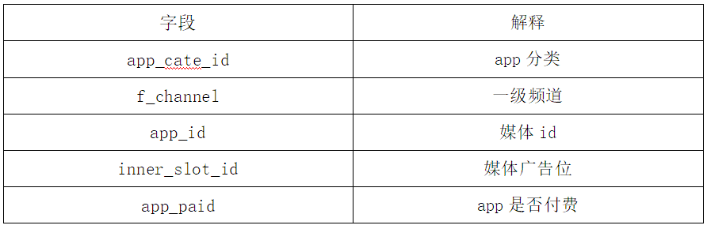
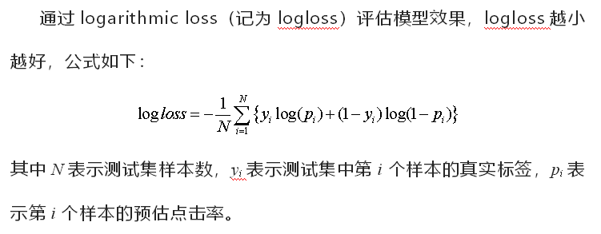

# 背景

**背景**：广告点击率是媒体对广告主收费的核心指标，点击率越高媒体的收益就越高。讯飞AI营销云在高速发展过程中积累了 海量的广告数据和用户数据，深度分析相关数据探索广告点击率受哪些因素所影响，以此作为基础制作有效的业务特征，最 终构建出一个能够预测用户广告点击率的机器学习模型。 

# 任务

**讯飞AI营销广告点击率预估，预测广告被点击的概率。**

# **数据**

备注：报名参赛或加入队伍后，可获取数据下载权限。

提供下载的数据集包括两个部分：

初赛：

1. round1_iflyad_train.txt 训练集，每一行数据为一个样本，可分为5类数据，包含基础广告投放数据、广告素材信息、媒体信息、用户信息和上下文信息，共1001650条数据。其中‘click’字段为要预测的标签，其它34个字段为特征字段。 
2.  round1_iflyad_test_feature.txt 测试集，共40024条数据，与训练集文件相比，测试集文件无‘click’字段，其它字段同训练集。

复赛：

1. round2_iflyad_train.txt 训练集，每一行数据为一个样本，可分为5类数据，包含基础广告投放数据、广告素材信息、媒体信息、用户信息和上下文信息，共1998350条数据。其中‘click’字段为要预测的标签，其它34个字段为特征字段。  
2. round2_iflyad_test_feature.txt  测试集，共80276条数据，与训练集文件相比，测试集文件无‘click’字段，其它字段同训练集。

出于数据安全保证的考虑，所有数据均为脱敏处理后的数据。数据集提供了若干天的样本，最后一天数据构成了测试集，其余日期的数据作为训练数据。

注意：此次比赛分为初赛和复赛两个阶段，两个阶段的区别是所提供样本的量级有所不同，其他的设置均相同。 5类数据的描述如下：

## 基本数据:

## 广告信息:

## 媒体信息：

## 用户信息：

## 上下文信息：

补充说明： 1.advert_industry_inner字段数据样例为102400_102401，“102400(前者)”表示广告主一级行业标签id，“102401(后者)”表示广告主二级行业id，如“教育_培训” 2.time字段脱敏后为有序排列，且时间间隔和与真实时间对应。

评分标准

AB榜的划分方式和比例：

【1】评分采用AB榜形式。排行榜显示A榜成绩，竞赛结束后2小时切换成B榜单。B榜成绩以选定的两次提交或者默认的最后两次提交的最高分为准，最终比赛成绩以B榜单为准。

【2】此题目的AB榜是随机划分，A榜为随机抽样测试集50%数据，B榜为另外50%。

说明：

1、初赛和复赛均提供下载数据，选手在本地进行算法调试，在比赛页面提交结果

2、比赛采用AB榜，A榜成绩供参赛队伍比赛中查看，最终比赛排名采用B榜成绩

3、排行按照logloss得分从低到高排序，排行榜将选择选手的历史最优成绩进行排名。