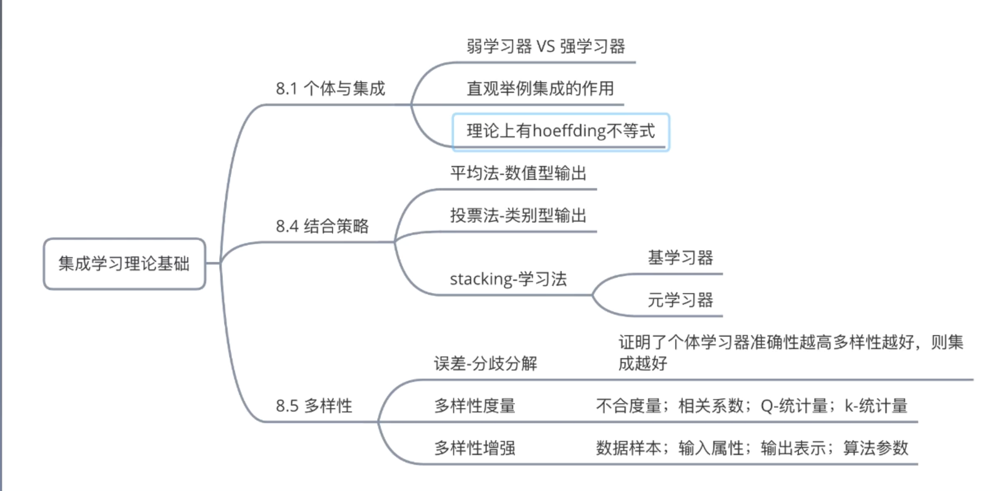
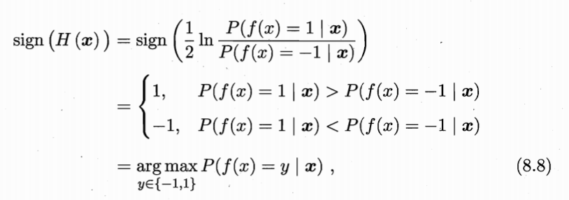
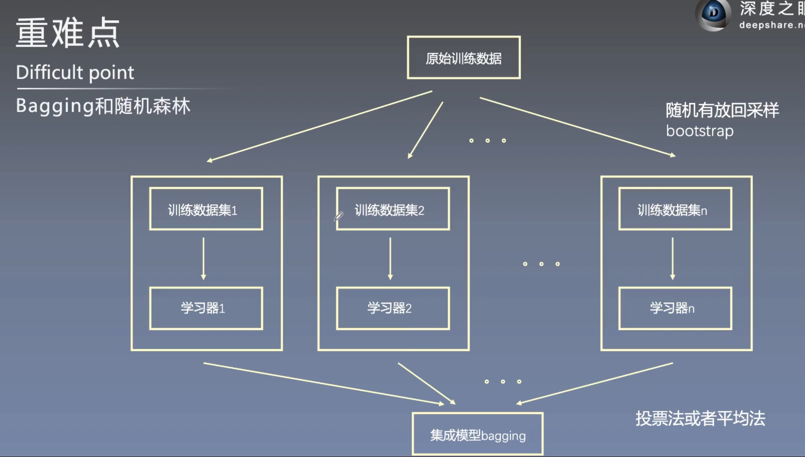
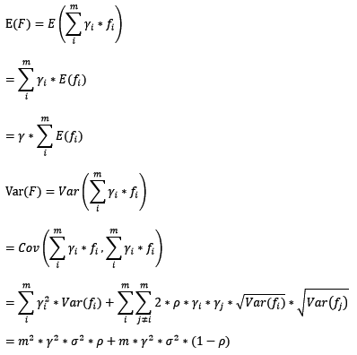

# **集成学习**(ensemble learning)：

## 脑图总结:

集成学习的理论基础

## 8.1 个体与集成

​       **:smile:集成学习**通过构建并结合多个学习器来完成学习任务，有时也被称为多分类器系统、基于委员会的学习等。

1. 集成中只包含同种类型的个体学习器，这样的集成是同质的（homogeneous）。

   <!--例如“决策树集成”中全是决策树，“神经网络集成”中全是神经网络。-->

2. 同质集成中的个体学习器称“基学习器”（base learner）:wink:相应的学习算法称为“基学习算法”

3. “异质”（heterogenous）：集成包含不同类型的个体学习器。

    <!--例如同时包含决策树和神经网络，异质集成中的个体学习器由不同的学习算法生成，就没有基学习算法，对应也没有基学习器，其个体学习器叫“组件学习器“（component learner）或直接叫”个体学习器“-->

   

集成学习通过将多个学习器进行结合，常可获得比单一学习器显著优越的泛化性能。这对“弱学习器”（weak learner）尤为明显。

集成学习的结果通过投票法（voting）产生，即“少数服从多数”。

​    

- 图8.2（a）中，每个分类器都只要66.6%的精度,但集成学习却达到了100%
- 图8.2（b）中，三个分类器没有差别，集成之后性能没有提高
- 图8.2（c）中，每个分类器的精度都只有33.3%，集成学习的结果变得更糟

:laughing:这个简单的例子得出：要获得好的集成，个体学习器应“好而不同”，即个体学习器要有一定的“准确性“，即学习器不能太坏，并且要有”多样性“（diversity），即学习期具有差异。

**事实上，个体学习器的“准确性”和“多样性”本身就存在冲突。一般的，准确性很高之后，要增加多样性就需牺牲准确性。事实上，如何产生并结合“好而不同”的个体学习器，恰是集成学习研究的核心。**

目前集成学习方法大致分为两大类

1. **Boosting（序列集成）**：个体学习器间存在强依赖关系（基模型是弱模型——偏差高，方差小）**（故模型是为了减少偏差！）**

   必须串行生成序列化方法。这一类的代表是Boosting系列集成(常见的算法有Adaboost,GBDT)
   <!--基模型是**弱模型**的理解----因为是串行的，强调偏差高可以通过串行（权重分配）强化进而**减少偏差**，方差小直接避免了模型的过拟合。-->

2. **Bagging（并行集成）和 ”随机森林“（Random Forest）**：个体学习器不存在强依赖关系（基模型是强模型——偏差低，方差大）**（故模型是为了方差！）**

   可以**并行**化生成每个个体学习器，这一类的代表是Bagging系列集成（常见的算法有RandomForest）。

   > <!--基模型是**强模型**的理解----因为是并行的，模型预测时常通过投票机制，所以强调基模型的偏差小（准确高），通过投票机制间接**减少方差。**-->

## [8.2 集成算法Boosting:smile:](https://www.bilibili.com/video/BV1wx411o7CK?p=9)

​      Boosting是**一族**可将弱学习器提升为强学习器的算法，这族算法的工作机制类似：先从初始训练集训练处一个基学习器，再根据基学习器的表现对训练样本分布进行调整，使得先前基学习器做错的训练样本在后续受到更多关注，然后基于调整后的样本分布来训练下一个基学习器；如此重复进行，直至基学习器达到先指定的值T，最终将这个T个基学习器进行加权结合。

### (1)AdaBoosting（Adaptive  Boosting）

​       Boosting**族**算法最著名的代表是AdaBoost，其描述如图8.3所示，其中

是真实函数。AdaBoost算法有多种推导方式，比较容易理解的是基于“加性模型”（addtive model），即基学习器的线性组合

来最小化指数损失函数

若H（x）能令指数损失函数最小化，则考虑式（8.5）对H（x）的偏导

令式（8.6）为零可解得

因此,有

**详情看<<西瓜书>>pdf P174 页**

AdaBoost是Boosting中最为典型的代表，集成问题不外乎是将多个弱学习器进行组合成强学习器。

~~在Bosting大概解决了弱学习器组合成强学习器中的训练数据权重问题（**做错的样本受到更多的关注**），弱学习器的权重分布问题（**T个基学习器根据他们的预测表现来施加不同的权重**）。~~ 

对于AdaBoosting的来讲，当我们理解了Boosting后，AdaBoosting也就明白了！

**但是在这里再深入下这两个问题**

假设弱分类器为 Gi​(x)，它在强分类器中的权重 αi​，那么就可以得出强分类器 f(x)：

有了这个公式，为了求解强分类器，你会关注两个问题：

**如何得到弱分类器，也就是在每次迭代训练的过程中，如何得到最优弱分类器？**
每个弱分类器在强分类器中的权重是如何计算的？

我们先来看下第二个问题。
实际上在一个由 K 个弱分类器中组成的强分类器中，如果弱分类器的分类效果好，那么权重应该比较大，如果弱分类器的分类效果一般，权重应该降低。所以我们需要基于这个弱分类器对样本的分类错误率来决定它的权重，用公式表示就是：

其中 $e_i$​ 代表第 i 个分类器的分类错误率。

然后我们再来看下第一个问题，如何在每次训练迭代的过程中选择最优的弱分类器？

​       实际上，AdaBoost 算法是通过改变**样本的数据分布**来实现的。

1. AdaBoost 会判断每次训练的样本是否正确分类，对于正确分类的样本，降低它的权重，对于被错误分类的样本，增加它的权重。再基于上一次得到的分类准确率，来确定这次训练样本中每个样本的权重。:smile_cat:
2. 然后将**修改过**权重的新数据集**传递给**下一层的分类器进行训练。这样做的好处就是，通过每一轮训练样本的动态权重，可以让训练的焦点集中到难分类的样本上，最终得到的弱分类器的组合更容易得到更高的分类准确率。
3. 我们可以用 $D_k+_1$ 代表第 k+1 轮训练中，样本的权重集合，其中 $W_k+_1,_1$ 代表第 k+1 轮中第一个样本的权重，以此类推 $W_k+_1,_N$代表第 k+1 轮中第 N 个样本的权重，因此用公式表示为：
   
   第 k+1 轮中的样本权重，是根据该样本在第 k 轮的权重以及第 k 个分类器的准确率而定，具体的公式为：
   

- 渐进的方式实现了加法模型

- 每个阶段学习一个弱分类器来弥补前面整个分类器(也是由弱分类器组成的)的缺憾
- 每一个阶段学习的时候,分错的点会增加训练的权重

### (2) GBDT（Gradient Boost Decision Tree)

GBDT与传统的Boosting（AdaBoost）有稍微一点的区别，区别主要集中在训练集样本的分布上，Boosting关注判断**错误的样本**；GBDT关注的是**上一次的残差**。

**GBDT的核心就在于，每一棵树学的是之前所有树结论和的残差(负梯度)**，这个残差就是一个加预测值后能得真实值的累加量。

比如A的真实年龄是18岁，但第一棵树的预测年龄是12岁，差了6岁，即残差为6岁。那么在第二棵树里我们把A的年龄设为6岁去学习，如果第二棵树真的能把A分到6岁的叶子节点，那累加两棵树的结论就是A的真实年龄;如果第二棵树的结论是5岁，则A仍然存在1岁的残差，第三棵树里A的年龄就变成1岁，继续学。Boosting的最大好处在于，每一步的残差计算其实变相地增大了分错instance的权重，而已经分对的instance则都趋向于0。这样后面的树就能越来越专注那些前面被分错的instance。

### (3) XGBoost

**类似于GBDT，但将其目标函数展开到二次，并且直接加入正则化项！**

除了算法上与传统的GBDT有一些不同外，XGBoost还在工程实现上做了大量的优化。总的来说，两者之间的区别和联系可以总结成以下几个方面。

1. GBDT是机器学习算法，XGBoost是该算法的**工程实现**。
2. 在使用CART作为基分类器时，XGBoost显式地加入了**正则项**来控制模 型的复杂度，有利于防止过拟合，从而提高模型的泛化能力。
3. GBDT在模型训练时只使用了代价函数的一阶导数信息，XGBoost对代 价函数进行**二阶泰勒展开**，可以同时使用一阶和二阶导数。
4. 传统的GBDT采用CART作为基分类器，XGBoost支持**多种类型的基分类 器**，比如线性分类器。
5. 传统的GBDT在每轮迭代时使用全部的数据，XGBoost则采用了与随机 森林相似的策略，支持对**数据进行采样**。
6. 传统的GBDT没有设计对缺失值进行处理，XGBoost能够自动学习出缺 失值的处理策略。

## 8.3 Bagging和随机森林:smile:

在随机森林中，集成中的每棵树都是由从训练集中**抽取的样本（即 bootstrap 样本）**构建的。另外，与使用所有特征不同，这里**随机选择特征子集**，**从而进一步达到对树的随机化目的。**

因此，随机森林产生的偏差略有增加，但是由于对相关性较小的树计算平均值，估计方差减小了，导致模型的整体效果更好。

RandomForest是Bagging的一种变体，在Bagging的基础上引进了**属性干扰**这一策略，主要是用来提高基学习器之间的多样性，具体规则：传统的决策树是在整个属性集上选择最优的属性来划分样本集合，**而RandomForest先在属性集上随机选取k个属性组成一个子属性集，然后在这个子属性集上选择最优的属性来划分样本集合，这里的参数k控制了随机性的引入程度，一般情况下推荐k=log2d，d为属性集的大小。**

## 1. 三种常见的集成学习框架(介绍)

目前，有三种常见的集成学习框架：boosting，bagging和stacking。

### Boosting:

训练过程为阶梯状，基模型按次序一一进行训练（实现上可以做到并行），基模型的训练集按照某种策略每次都进行一定的转化。对所有基模型预测的结果进行线性综合产生最终的预测结果：

### Bagging(装袋算法):

从训练集从进行子抽样组成每个基模型所需要的子训练集，对所有基模型预测的结果进行综合产生最终的预测结果：

​        Bagging是通过结合几个模型降低泛化误差的技术。主要想法是分别训练几个不同的模型，然后让所有模型表决测试样例的输出。 [1] 这是机器学习中常规策略的一个例子，被称为模型平均（modelaveraging）。采用这种策略的技术被称为集成方法。 [1] 

​       模型平均（model averaging）奏效的原因是不同的模型通常不会在测试集上产生完全相同的误差。模型平均是一个减少泛化误差的非常强大可靠的方法。

### Stacking:

将训练好的所有基模型对训练基进行预测，第j个基模型对第i个训练样本的预测值将作为新的训练集中第i个样本的第j个特征值，最后基于新的训练集进行训练。同理，预测的过程也要先经过所有基模型的预测形成新的测试集，最后再对测试集进行预测：

有了这些基本概念之后，直觉将告诉我们，由于不再是单一的模型进行预测，所以模型有了“集思广益”的能力，也就不容易产生过拟合现象。但是，直觉是不可靠的，接下来我们将从模型的偏差和方差入手，彻底搞清楚这一问题。

## 2.偏差和方差

广义的偏差（bias）描述的是预测值和真实值之间的差异，方差（variance）描述距的是预测值作为随机变量的离散程度。[《Understanding the Bias-Variance Tradeoff》](http://scott.fortmann-roe.com/docs/BiasVariance.html)当中有一副图形象地向我们展示了偏差和方差的关系：

### 2.1 模型的偏差和方差是什么?

模型的**偏差**是一个相对来说简单的概念：训练出来的模型在训练集上的准确度。

　　要解释模型的方差，首先需要重新审视模型：模型是**随机变量**。设样本容量为n的训练集为随机变量的集合(X1, X2, ...,  Xn)，那么模型是以这些随机变量为输入的**随机变量函数**（其本身仍然是随机变量）：F(X1, X2, ...,  Xn)。**抽样的随机性**带来了模型的随机性。

　　<!--定义随机变量的值的差异是计算方差的前提条件，通常来说，我们遇到的都是**数值型**的随机变量，数值之间的差异再明显不过（减法运算）。但是，**模型的差异性**呢？我们可以理解模型的差异性为模型的结构差异，例如：线性模型中权值向量的差异，树模型中树的结构差异等。在研究模型方差的问题上，我们并不需要对方差进行定量计算，只需要知道其概念即可。-->

　　研究模型的方差有什么现实的意义呢？我们认为**方差越大**的模型**越容易过拟合**：假设有两个训练集A和B，经过A训练的模型Fa与经过B训练的模型Fb差异很大，这意味着Fa在类A的样本集合上有更好的性能，而Fb反之，这便是我们所说的过拟合现象。

　　我们**常说**集成学习框架中的基模型是弱模型，通常来说**弱模型是偏差高**（在训练集上准确度低）方差小（防止过拟合能力强）的模型。但是，并不是所有集成学习框架中的基模型都是弱模型。**bagging和stacking中的基模型为强模型<mark style=background-color:yellow>（偏差低方差高）</mark>**，boosting中的基模型为弱模型。

　　在bagging和boosting框架中，通过**计算基模型**的期望和方差，我们可以得到模型整体的期望和方差。为了简化模型，我们假设基模型的权重、方差及两两间的相关系数相等。由于bagging和boosting的基模型都是线性组成的，那么有

<!--请问bagging和boosting中的均值和方差具体是如何推导出来的呢，感觉有些字母不太明白含义，望解答，谢谢-->

1 可以看一下知乎上[为什么说bagging是减少variance，而boosting是减少bias?](https://www.zhihu.com/question/26760839)的过拟合的回答，以及**该回答下面的讨论**。他的回答中谈到的ESL这本书的第588页有相关讨论。
2 还可以看一下周志华教授的《机器学习》第44页开始关于偏差和方差的讲解。
3 本文期望与方差公式中，E是期望函数，Var是方差函数，F是整体模型，fi是第i个基模型，gamma是基模型权重，rou是基模型相关系数，sigma^2是基模型方差。

### 2.2 bagging的偏差和方差 

对于bagging来说，每个基模型的权重等于1/m且期望近似相等（子训练集都是从原训练集中进行子抽样），故我们可以进一步化简得到：

​        根据上式我们可以看到，整体模型的期望近似于基模型的期望，这也就意味着**整体模型的偏差和基模型的偏差近似**。

1. 同时，整体模型的方差小于等于基模型的方差（当相关性为1时取等号），随着基模型数（m）的增多，整体模型的方差减少，从而防止过拟合的能力增强，模型的准确度得到提高。
2. 但是，模型的准确度一定会无限逼近于1吗？并不一定，当基模型数增加到一定程度时，方差公式第二项的改变对整体方差的作用很小，防止过拟合的能力达到极限，这便是**准确度的极限**了。
3. 另外，在此我们还知道了为什么bagging中的基模型一定要为强模型，否则就会导致整体模型的偏差度低，即准确度低。

　　Random Forest是典型的基于bagging框架的模型，其在bagging的基础上，进一步降低了模型的方差。Random  Fores中基模型是树模型，在树的内部节点分裂过程中，不再是将所有特征，而是随机抽样一部分特征纳入分裂的候选项。这样一来，基模型之间的相关性降低，从而在方差公式中，第一项显著减少，第二项稍微增加，整体方差仍是减少。

### 2.3 boosting的偏差和方差

对于boosting来说，基模型的训练集抽样是强相关的，那么模型的相关系数近似等于1，故我们也可以针对boosting化简公式为：

通过观察整体**方差的表达式**，我们容易发现，若基模型不是弱模型，其方差相对较大，这将导致整体模型的方差很大，即无法达到防止过拟合的效果。<mark style=background-color:yellow>因此，boosting框架中的基模型必须为弱模型。</mark>

　　因为基模型为弱模型，导致了每个基模型的准确度都不是很高（因为其在训练集上的准确度不高）。随着基模型数的增多，整体模型的期望值增加，更接近真实值，因此，整体模型的准确度提高。但是准确度一定会无限逼近于1吗？仍然并不一定，因为训练过程中准确度的提高的主要功臣是整体模型在训练集上的准确度提高，而随着训练的进行，整体模型的方差变大，导致防止过拟合的能力变弱，最终导致了准确度反而有所下降。

　　基于boosting框架的Gradient Tree Boosting模型中基模型也为树模型，同Random Forrest，我们也可以对特征进行随机抽样来使基模型间的相关性降低，从而达到减少方差的效果。

### 2.5 小结

​       还记得调参的目标吗：模型在训练集上的准确度和防止过拟合能力的大和谐！为此，我们目前做了一些什么工作呢？

1. 使用模型的偏差和方差来描述其在训练集上的准确度和防止过拟合的能力
2. 对于**bagging**来说，整体模型的偏差和基模型近似，随着训练的进行，整体模型的方差降低
3. 对于**boosting**来说，整体模型的初始偏差较高，方差较低，随着训练的进行，整体模型的偏差降低（虽然也不幸地伴随着方差增高），当训练过度时，因方差增高，整体模型的准确度反而降低
4. 整体模型的偏差和方差与基模型的偏差和方差息息相关

　　这下总算有点开朗了，那些让我们抓狂的参数，现在可以粗略地分为两类了：控制整体训练过程的参数和基模型的参数，这两类参数都在影响着模型在训练集上的准确度以及防止过拟合的能力。

### 2.4 模型的独立性

​        如何衡量基模型的独立性？我们说过，抽样的随机性决定了模型的随机性，如果两个模型的训练集抽样过程不独立，则两个模型则不独立。这时便有一个天大的陷阱在等着我们：bagging中基模型的训练样本都是独立的随机抽样，但是基模型却不独立呢？

　　我们讨论模型的随机性时，抽样是针对于样本的整体。而bagging中的抽样是针对于训练集（整体的子集），所以并不能称其为对整体的独立随机抽样。那么到底bagging中基模型的相关性体现在哪呢？在知乎问答[《为什么说bagging是减少variance，而boosting是减少bias?》](https://www.zhihu.com/question/26760839)中请教用户[“过拟合”](https://www.zhihu.com/people/guo-ni-he)后，我总结bagging的抽样为两个过程：

1. 样本抽样：整体模型F(X1, X2, ..., Xn)中各输入随机变量（X1, X2, ..., Xn）对样本的抽样
2. 子抽样：从整体模型F(X1, X2, ..., Xn)中随机抽取若干输入随机变量成为基模型的输入随机变量

　　假若在子抽样的过程中，两个基模型抽取的输入随机变量有一定的重合，那么这两个基模型对整体样本的抽样将不再独立，这时基模型之间便具有了相关性。

## 参考资料盘点

<<机器学习>>周志华

https://www.cnblogs.com/jasonfreak/p/5657196.html

http://www.360doc.com/content/18/0101/17/40769523_718161675.shtml

深度之眼

百度百科 https://baike.baidu.com/item/bagging/15454674?fr=aladdin

## 拓展内容(面试中常见的问题)

梯度提升树

1. gbdt原理
2. gbdt在处理特征方面有哪些优势和不足
3. 比较随机森林与GBDT
4. 比较adaBoost与GBDT
5. 比较LR与GBDT
6. 比较XGB与GBDT