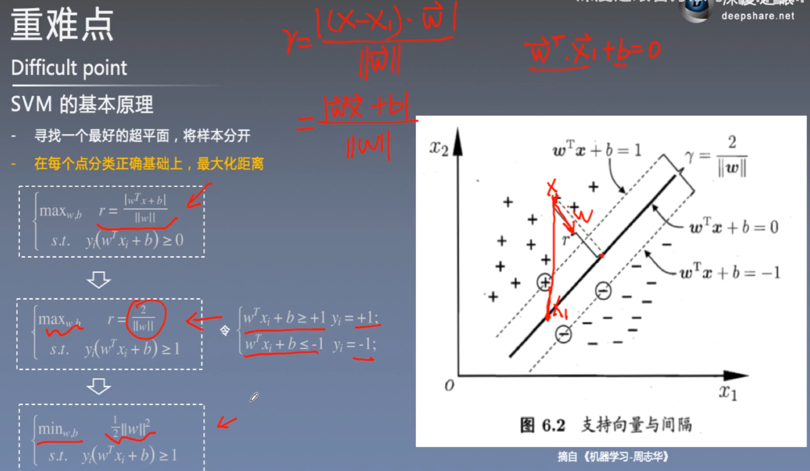
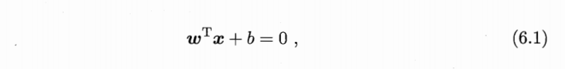
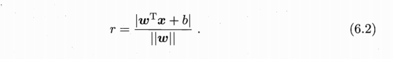
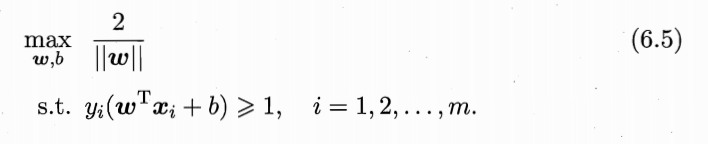
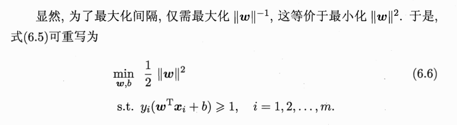
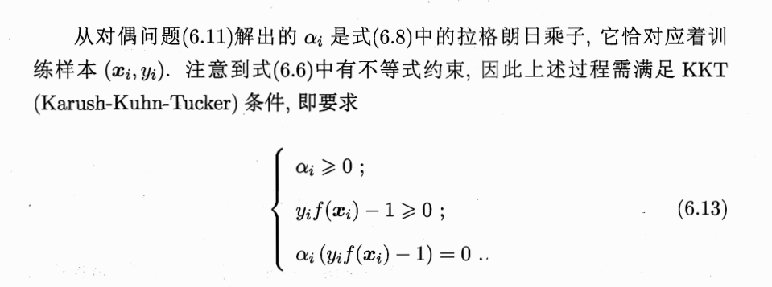
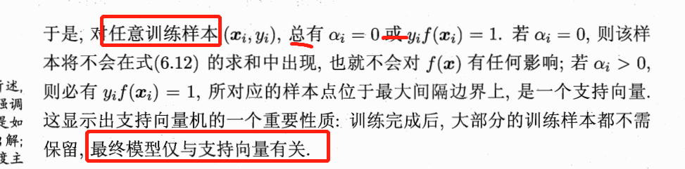
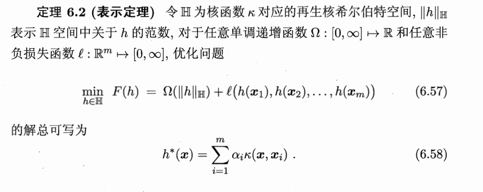

# SVM

## 6.1 间隔与支持向量

在样本空间中，划分超平面可通过如下线性方程来描述：

​        其中 **w** = （w1；w2,；...wd)为法向量，决定了超平面的方向；b为位移项，决定了超平面与原点之间的距离。显然，划分超平面可被法向量w和位移b确定，下面我们将其记为（w，b）。样本空间中任意点x到超平面（w，b）的距离可写为

<!--通过上面ppt图可以看出怎么推出来的-->

如图6.2所示，距离超平面最近的这几个训练样本点（6.3）的等号成立，它们被称为“支持向量”（support vecotr），两个**异类**（一正一负）支持向量到超平面的距离之和为

它被称为“间隔”（margin）

欲找到具有“最大间隔”（maximum agrgin）的划分超平面，也就是要找到能满足式（6.3）中约束的参数w和b，使得y最大，即

这就是支持向量机（Support Vector Machine，简称SVM）的基础型。

## 6.2 对偶问题

<!--详细公式参考《西瓜书》pdf第123页-->

## 6.3 核函数

### 几种常用核函数

## 6.4 软间隔与正则化

缓解该问题(线性不可分)的一个方法是**允许支持向量机在一些样本上出错**，为此，要引入“软间隔”（soft margin）的概念，如图6.4所示。

这就是常用的“软间隔支持向量机”

## 6.5 支持向量回归

## 6.6 核方法

参考林轩田《机器学习技法》，SVM这部分的推导讲得很清楚；或者参考https://blog.csdn.net/abcjennifer/article/details/7849812/）

《机器学习技法》第1课笔记 线性SVMhttps://blog.csdn.net/u013382288/article/details/80978410

《深度之眼》